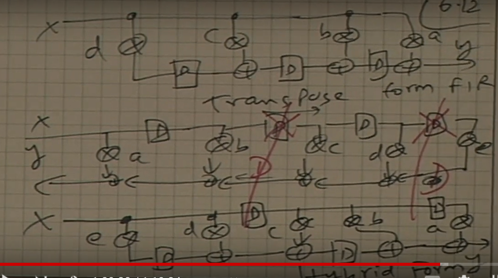
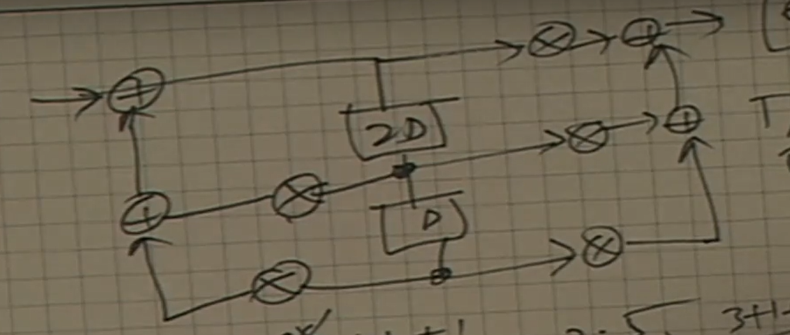
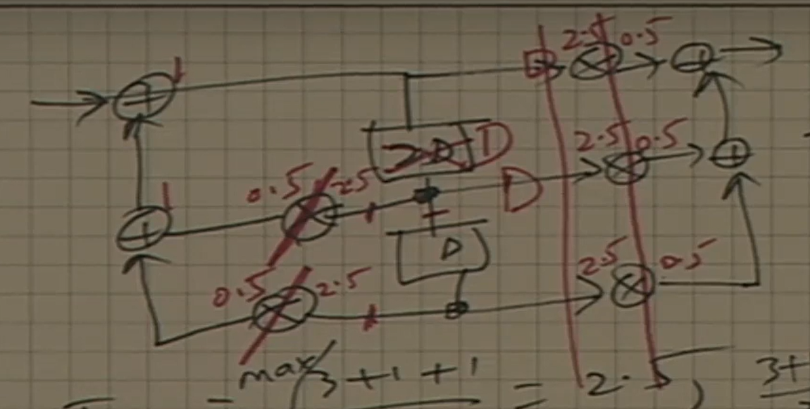

# Retiming
## Art of moving delays around.
1. Ideas of node retiming can be generalized into cutset retiming.
2. Valid cutset retiming means we can remove the $ith$ delays of a certain cutset input, then attach  $ith$ delay to the output. We call this a valid retiming.
3. DFG graph and graph algorithm concepts are used extensively here.
4. Remove incoming edge delays by 1, add 1 outgoing delay to output edge.

# Pipeling v.s. Retiming.
0. Moving existing delays around a feedbackward cutset(Retiming), pipelining introduces delays around a feedforward cutset.
1. Pipeling algorithm is consulted if we want to perform operation on feed-forward cutset
2. Retiming is consulted if we want to perform opeartion on feed-back cutset.
3. Retiming does not change number of delays in a certain loop.
4. We must make sure that the delay in every loop must remain the same.
5. Retiming algorithm should not change the loop bound and the number of delays in each loop.
6. Retiming reduces critical path by not changing latency.
7. Pipeling reduces cirtical path by increasing latency.
> In retiming, feedbackback cutset is consulted, in pipelining feedforward cutset is consulted.

# Retiming algorithm
1. Retiming variable i needs to be found to perform valid retiming on the circuit.
2. You can verify that the sum of all delays conserved after retiming, so the loop bound and $T_{\infin}$ is preserved.
3. $w_r(U->V)$ = delays from node U to V.

# How retiming can lead to equivalent data-flow graph?
0. Consider a FIR filer. What is the tranposed form and direct form relationship between Retiming technique?
1. Associativity property of add.
2. By rearranging the adders position then apply retiming to the circuit, we can restructure the circuit.
3. We can thus get the transposed data broadcasting form.
4. We can also derive hybrid form from retiming technique.

# Hybrid form

0. Consider an FIR filter, find its tranposed form, direct form and its hybrid form.
1. Instead of retiming on all delays, retiming only on the partial part of circuit.
2. Associativity property of arithmetics are also exploited.

# Reducing critical path using Retiming technique.

1. Consider a biquad IIR filter, try to apply pipeling technique and retiming technique onto it to reduce the critical paths.
2. We can actually move registers into multiplications after analysis.
3. We can apply pipeling technique and retiming technique together s.t. we can reduce the critical path.
