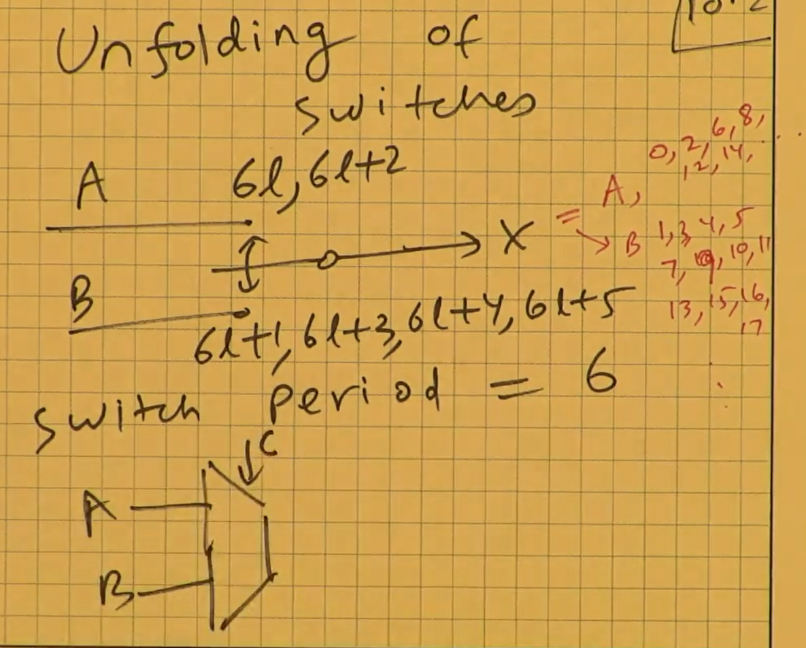
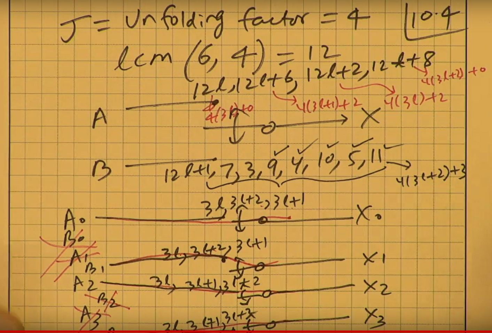
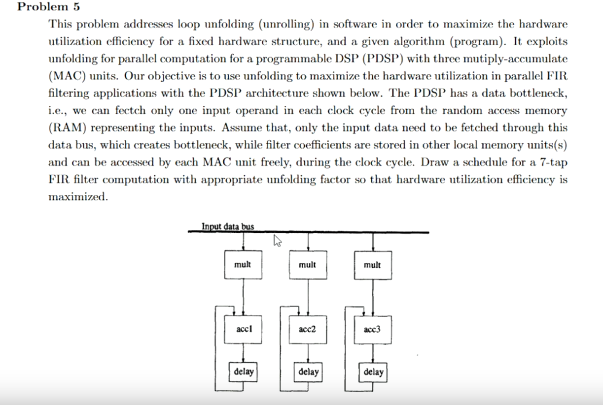

# Unfolding
- It can be used to describe more than 1 iteration of the program.
1. The unfolding algorithm are given as follows:
- From the unfolding factor J expands the nodes. And draw the DFG. For every Node U draw the corresponding $U_0,U_1,U_2,....$
- $U_i$->$V_{(i+w) modJ}$ with $[i+w/J]$ delays
1. Generalization of parrallel processing (Loop unrolling)
2. Similar to loop unrolling.
3. Unfolding factor J = 3 meaning replacing each node from DFG you find with 3 replicated but different time series signals.
4. $A->A_0,A_1,A_2$ etc.....
5. 3 unfolded data flow graph, A_0 start sends signal 0,3,6,9. A_1 start sends signals 1,4,7,10
6. After determining the unfolding factor, we would need to redraw the DFG to analyze the system again.
7. Expanding them out to observe the system clearly.
8. The unfolded DFG can be obtained from the orignal DFG.
9.  For a J-unfolded DFG, $T_{\infin}=JT_{\infin}$
10. The unfolded factor must be in match as the maximum common product with the iteration bound.

# Unfolding a digital filter
1. First assign the nodes.
2. Then draw out the flow graph, connecting the necessary components and arithmetic units together.
3. By drawing the DFG then consider the signal needed by each nodes, note the time must be considered to derive the correct delay for each weight of your vertex.
4. By marking the sequence to process on the node, unfolding graph can be derived more easily to prevent mistakes.

# Unfolding of switches

1. Switches example
2. Try to unfold this using modulo operation.
3. Consider unfolding factor J =3

4. $6l = 3*2l + 0 , 6l+2 = 3*2l + 2$ , connect A0 to x0 @ 2l
5. Unfolding factor J = 4
6. find the least common product of two vale , unroll the sequence, to rederive the whole sequences switches.
7. After deriving the unfolded version, prune the unwanted portion away from the circuit. To give a simplified version.

# More examples
0. We are trying to unfold a word sequence of W=4 with an unfolding factor J=3

1. If the unfolding factor is no longer a divisor of the sequence period, we can actually expand out the ckt by considering the least common mode of ckt period and unfolding factor i.e. lcm(W,J). In this case, it is 12.
2. Find the rederived sequence period for each signal s.t. we can get the right sampled sequences for both A and B.
3. In this derivation process, switches can be drawn, sequences should be written out to clearly understand what is going on to the input and output sequences.

# Unfolding
1. Used on DSP compilers to reduce iteration period.
2. Generating Parallel VLSI algorithm.
3. Unfolding has a lot of chances of exploiting hardware parrallelism and a great way to specify all the delays and period within a circuit.
4. Swtiches are then added to ensure the correctness of the data feed in process.

# Application(Word serial - parallel processing)
1. Bit serial- digital serial.

# Table charts
1. When describing repetitive iterations of a formula with different i, table can be drawn to clearly specify what is going on for a small number of iterations. This is also what the debugger do when you are debugging.

# Unfolding tips

0. Number of cycles can be marked onto the computational units(adders,multipliers) to have a clear view about what is going on.
1. When deriving schedules for unfolding algorithm, use the Multiple-clock cycle diagram and list out the equations with easy example to first illustrate what is going on.
2. Timing diagram can should be drawn to search and exploit parrallelism hidden within algorithm.
3. Then assign those data into the the architecture s.t. the value is sent into the system at the right moment.
4. Try the example again on DSP examples, review and rederive every process when doing this problem.