# <strong>
HW1 Least square approximation & QR iterative algorithm
</strong>
## 
VLSI DSP HW1

### 
Shun-Linag Yeh, NCHU Lab612

### 
3/16 2023

### 
[Github Src Code](https://github.com/sicajc/VLSI_DSP_Notes_HW_Project/tree/main/hw1)

# INDEX
1. [Least square approximation](#least-square-approximation)
2. [QR iterative algorithm](#qr-iterative-algorithm)
3. [References](#references)

# Least square approximation
## Problem
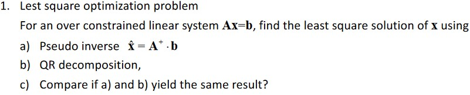 

## Derivation steps
1. For pseudoinverse uses the pinv matlab function to find the pseudoInverse of A, then approximation x through the equation.
2. For QR decomposition approximation, generate QR using matlab function , using the normal equation (A^t) Ax = (A^t)b, since A = QR, replace A with QR in the normal equation yields , plug the QR into the derived equation to get the solution.

## Code

  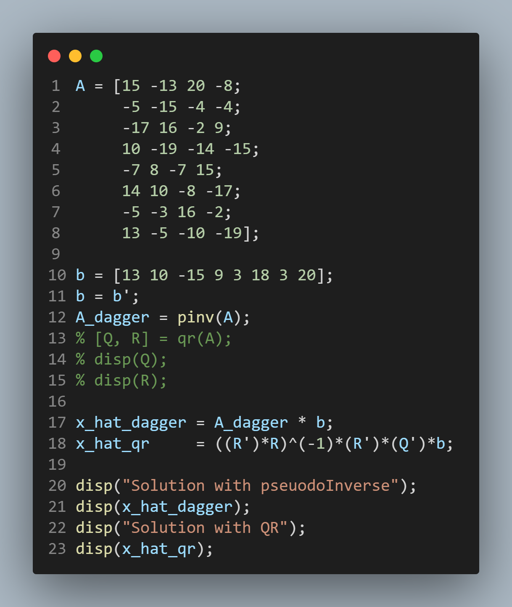

## Result

  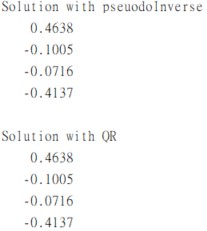

# QR iterative algorithm
## Problem

  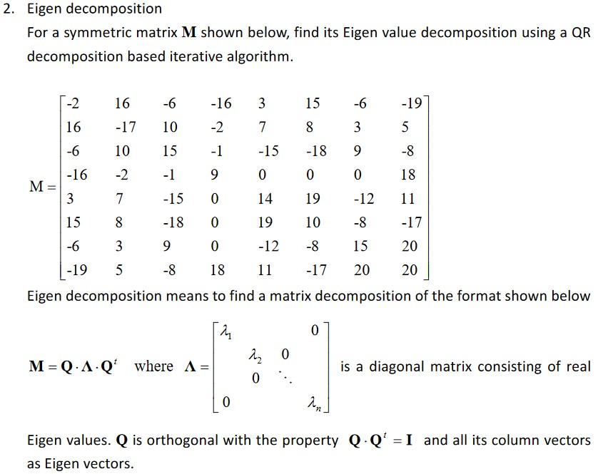

## Givens rotation

  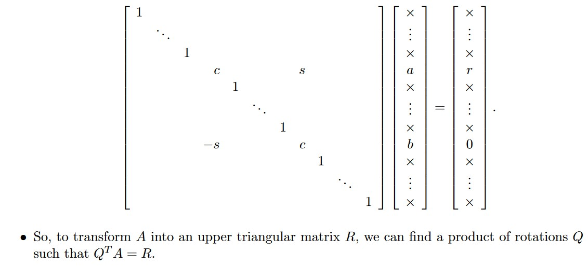

  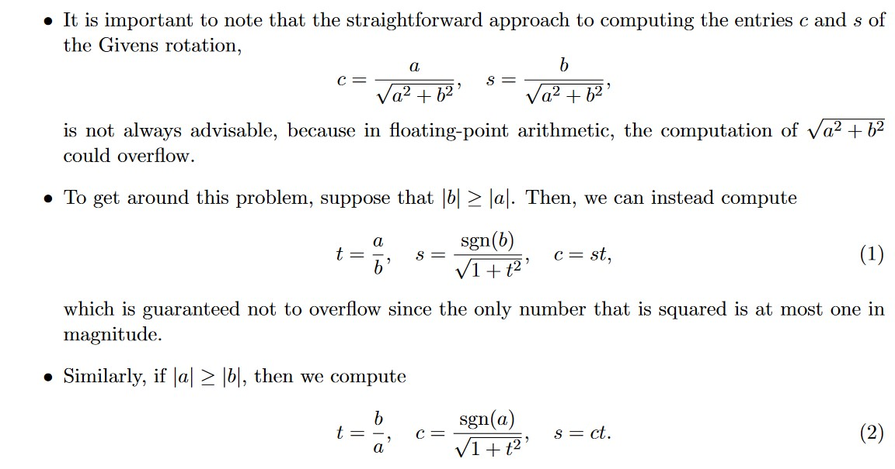

## Tridiagnalization
1. After computing M' = Q'M using givens rotation through the linear transformation of rotation matrices where Q' is products of a series of Rotation matrices G, we yields an upper triangular matrix that is close to tridiagonal form.
2. Replace the upper symmetrical part of M' with the same result as the lower entries where i<j.
3. We can get triangularized matrix M'',where M'' = Q Q' M

## QR Iterative Algorithm
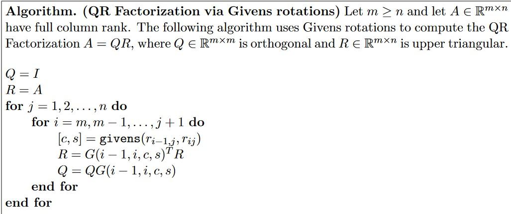

## Code
### Main driver

  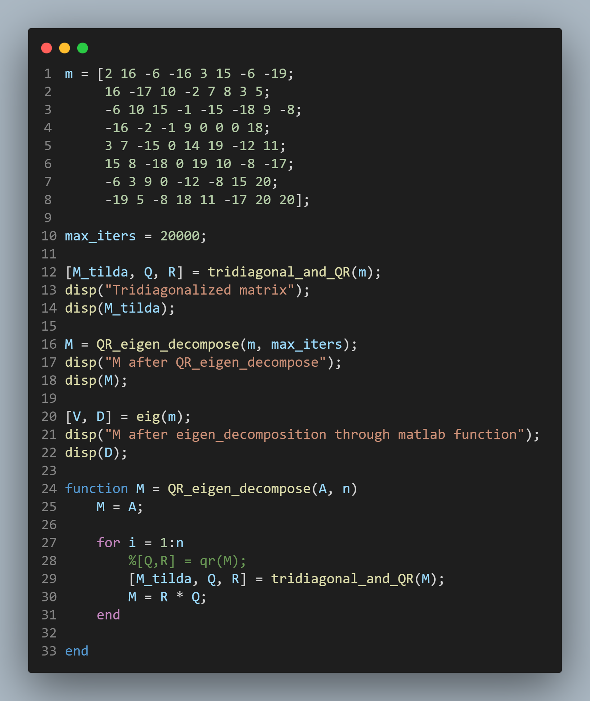

### Tridiagonalization and QR iterative

  

### Givens Rotation

  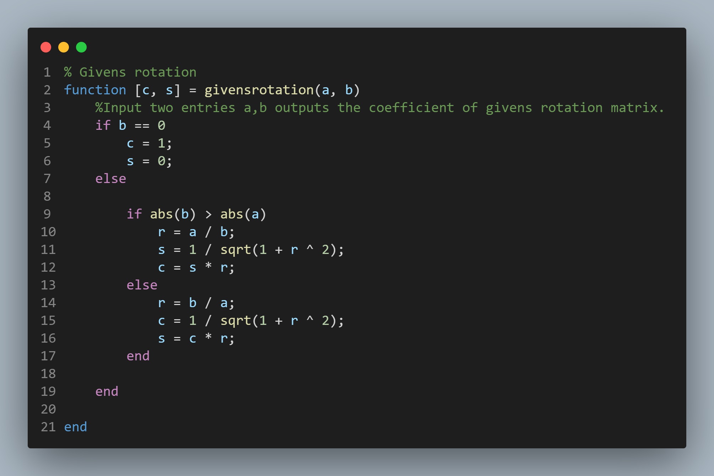

## Result
### Tridiagonalized matrix
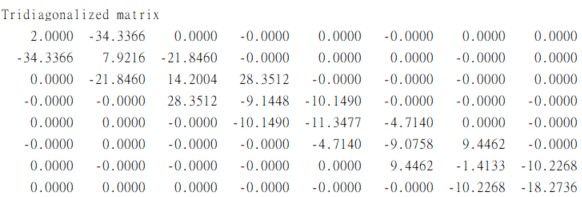

### Eigenvalue matrix after eigen-decomposition
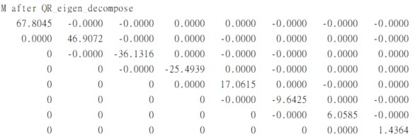

### Eigenvalue decompose using matlab
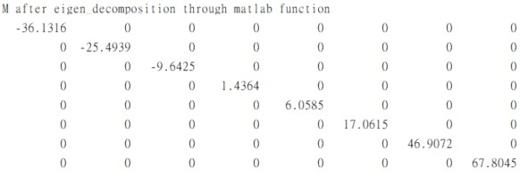

### Note
1. The result of the Eigen-decomposition differs due to the ordering of the orthnormal basis and the ordering of eigenvectors when calculating the QR matrcies.
2. The eigenvalues are all the same but in different orderings.

# Reference

[1] [University of South California, Section 4.2.1: Givens Rotations, Math610 Jim Lambers](https://www.math.usm.edu/lambers/mat610/class0208.pdf)
