# <strong>
HW2 LMS Filter and DWT Filter design
</strong>
## 
VLSI DSP HW2

### 
Shun-Linag Yeh, NCHU Lab612

### 
3/19/2023

### 
[Github Src Code](https://github.com/sicajc/VLSI_DSP_Notes_HW_Project/tree/main/hw2)

# INDEX
1. [Adaptive FIR Low pass filter](#i-adaptive-fir-low-pass-filter)
2. [Discrete Wavelet transform](#ii-discrete-wavelet-filter-design)
3. [References](#iii-references)

# I. Adaptive FIR Low pass filter
## Problem

  

# Derivation steps
### Adaptive Filter specification

  

1. x(n) is the input signal, wn(z) is the adaptive filter block with coefficients of wn.
2. d_hat(n) is the generated system response and d(n) is the desired signal.
3. e(n) is the error between d_hat(n) and d(n)
4. The adaptive algorithm block determines which kind of policy we should use to find the suitable filter coefficients. In this HW, LMS algorithm is chosen.

### The adaptive FIR filter

  

  

- The desired output is genereated through the p-tap FIR filter design, where wn is the coefficients that gets updated on the fly.

### Error function

  

- Error function simply is the difference between the desired signal and the generated system response.

- Ultimate goal is to minimize the autocorrelation between error vector and input signal.

### LMS algorithm

  

- mu is the step sizes for the algorithm, which governs the variability of the coefficients in each iteration.
- e(n)X*(n) is the factor of auto-correlation between the input signal and the error function.

### RMS(Root mean square)

  

- Root mean square used to find the norm of the error vector, we hope that this value be as small as possible s.t. the system is converged.

# Code
### Adaptive Filters

  

### RMS

  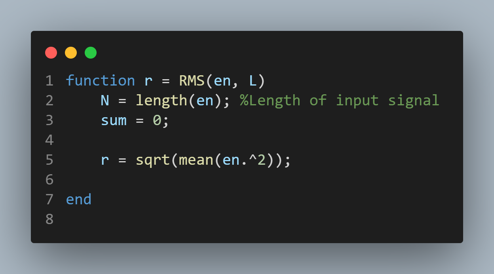

### Main drivers

  

  

# Results
## Adaptive Filter Response n=100, mu = 0.01, sampleSteps = 1 and RMS over time

  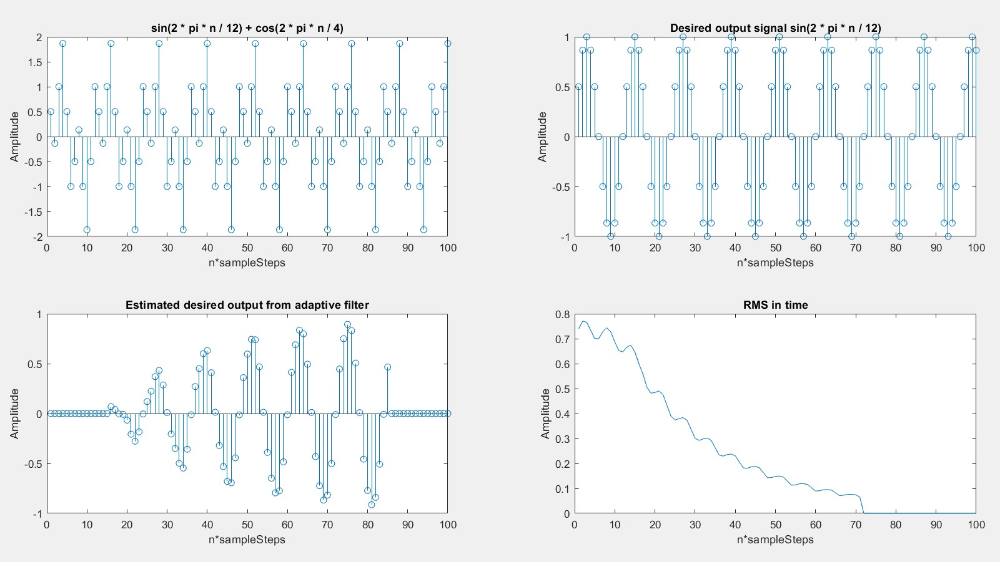

### Filter Coefficients over time

  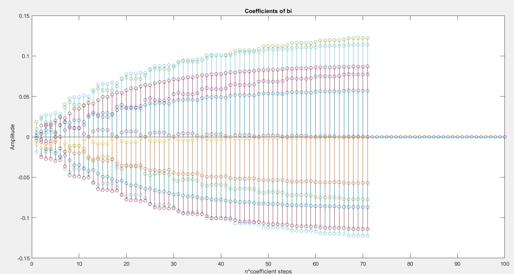

### Converged steps

  

### 64-point FFT spectrum

  

- The response is indeed a Low-Pass filter response.

## Adaptive Filter Response n=6000, mu = 0.0001, samepleSteps = 100 and RMS over time

  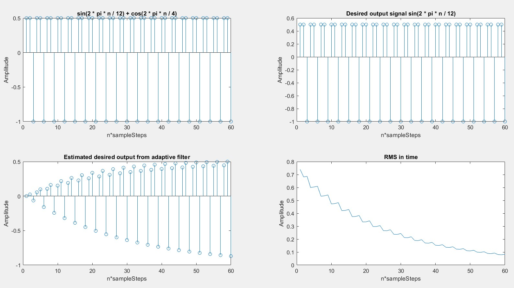

### Filter Coefficients over time

  

### Converged steps

  

- Notice the changing of the RMS value responses more drmatically due to smaller step difference. Also it takes longer and more sample points for it to converge.

### RMS with large sample size n = 20000

  

- The convergence bias is found, the filter cannot converge any further, it keeps on oscillating between within the convergence bias.

### Note
- Due to the fact that sample sizes are large for smaller mu, plotting all of the signals makes analysis hard, thus samples_steps is defined s.t. only a certain multiple of signal sample_steps are selected for plotting.

- The latest 16 prediction errors should be selected for caculation, selecting more than that might yield the wrong results, and the filter would never converge.

# II. Discrete Wavelet Filter Design
## Problem

  

  

- Goal is to build a DWT filter by adopting the (9/7) filters composed of high pass and low pass components.

## Problem a

  

## Problem b

  

  

# Derivation steps
## Wavelet transform

  

- For a fourier transform, the orthnormal basis is selected as e^j2piFt as analyzing function, however for the wavelet has orthonormal basis of wavelet analyzing fuction phi(t).
- Fourier transform ouputs frequency, yet wavelet outputs a translation and scaled autocorrelation of the input.

  

- Wavelet would has better time localization for high frequency yet worse time localization for low frequency.
- Wavelet is used to tackle with problem of time and frequency resolution since you cannot have both great time resolution and frequency resolution at the same time. Wavelet is the balance between time and frequency resolution.
- It is extensively used for compressing images.

## 2D DWT transform octave

  

- Each octave generates LL,LH,HH,HL subbands. The figure only shows octave1, for three level octave, 3 octaves must be cascaded together.

- The 3 level DWT structure has 3 octaves, where after passing each octaves the image becomes 2 times smaller than the original image due to down-Sampler.

- When doing downsampling, low pass filter sample the odd number output data, while high pass filters keep the even number output data.
## 2D IDWT transform octave

  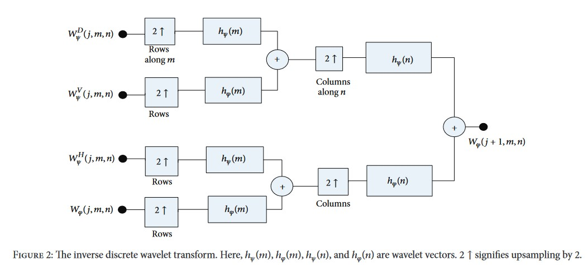

- The 3 level IDWT structure has 3 octaves also, where after passing each octaves the image becomes 2 times larger than the original image due to up-Sampler. During the upSampling process, action should be taken to combat the loss of information when doing up Sampling.

## Symmetric extension scheme

  

- Due to the boundary condition when doing filtering, one must extend the original signal length s.t. the boundary would not get convolved into 0 values.

## PSNR(Peak signal to noise ratio) and MSE(Mean square error)

  

- Used to check whether the reconstructed image is close to the original image or not.

## Wavelet Compression

  

- When using the DWT for JPEG2000, we generally would keep only a certain amount of wavelet coefficients after decomposition. The example shows the restored image after keeping only the largest 10%,5%,1% and 0.5% of wavelets coefficients. Those coefficients approach to 0 are thrown away.

# Code

### FIR Filter(Symmetric extended)

  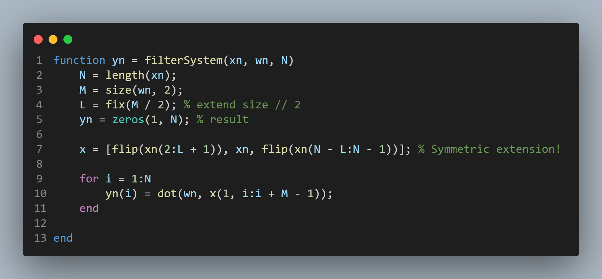

### g(n) High pass filter and h(n) low pass filter

  

### p(n) High pass filter and q(n) low pass filter

  

### Down Sampler

  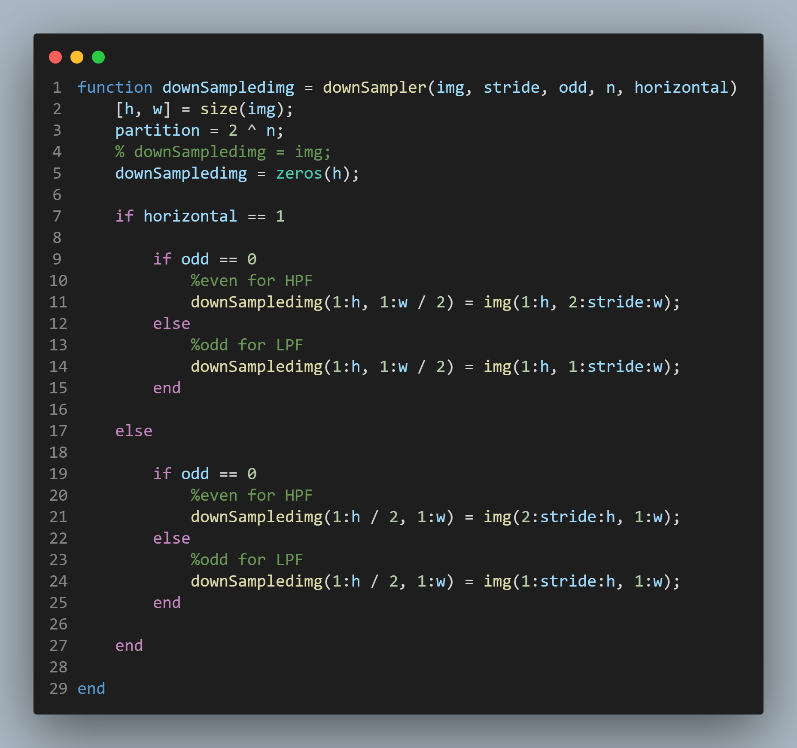

### UpSampler

  

### PSNR

  

### DWT octave

  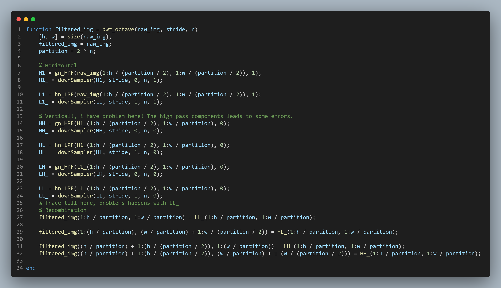

### IDWT octave

  

### Main driver

  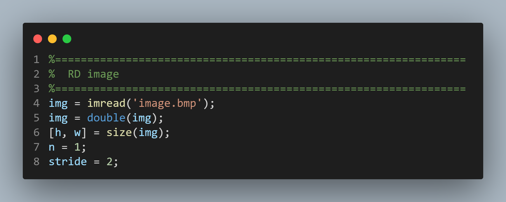

  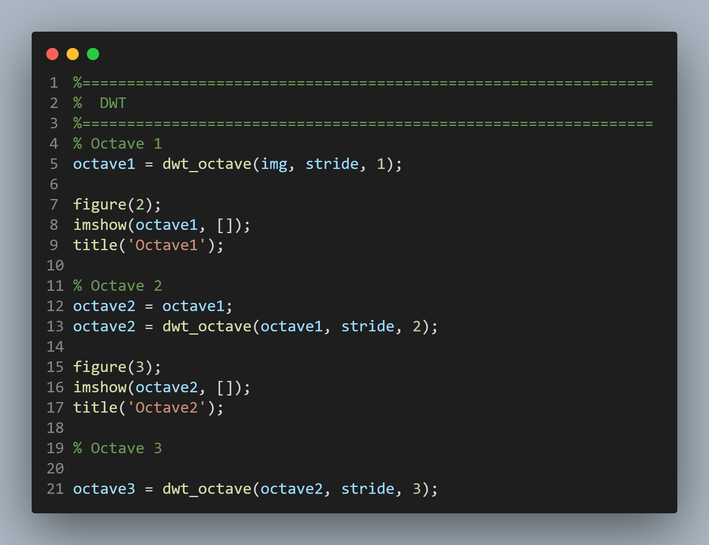

  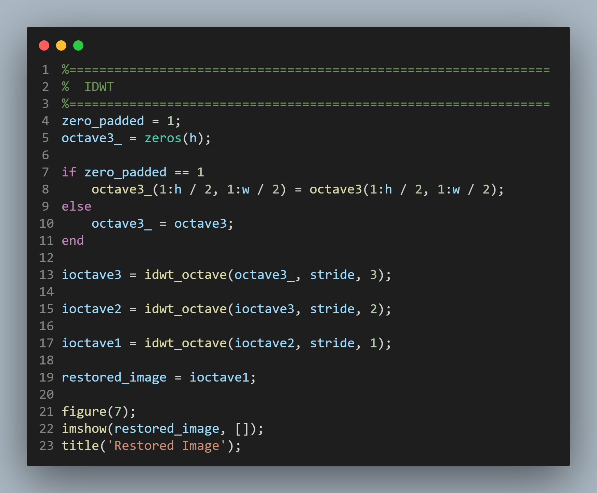

  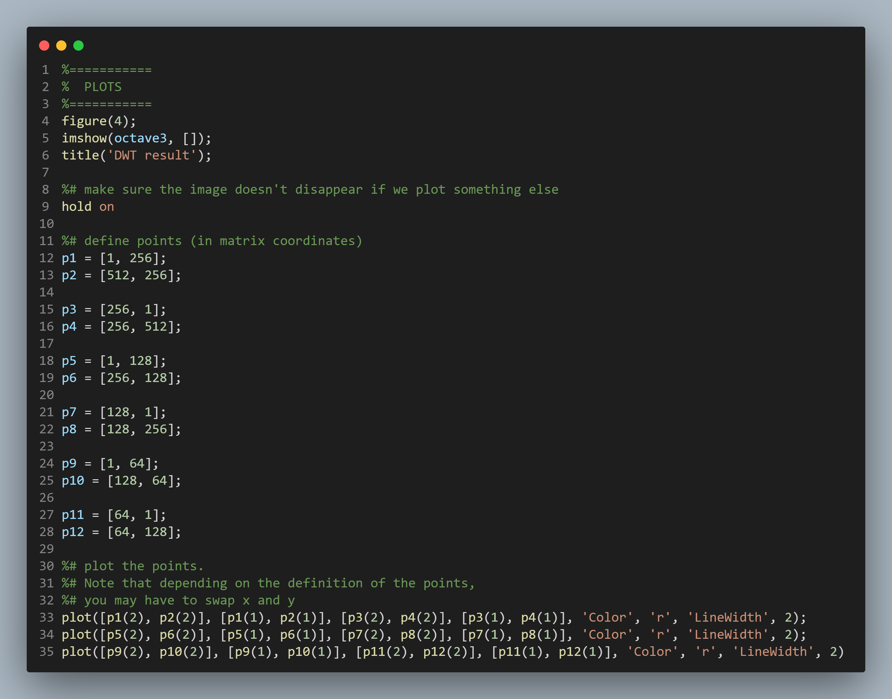

  

# Result
## Original image

  

## a) DWT result

  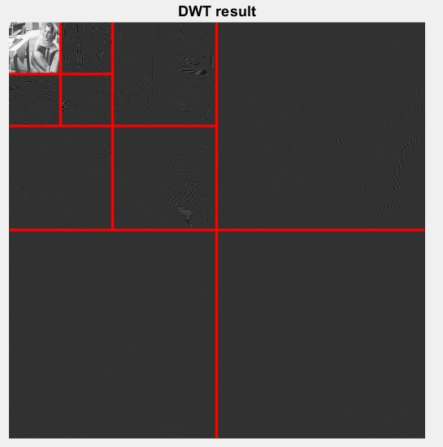

##  Holds LH,HH,HL Restored image

  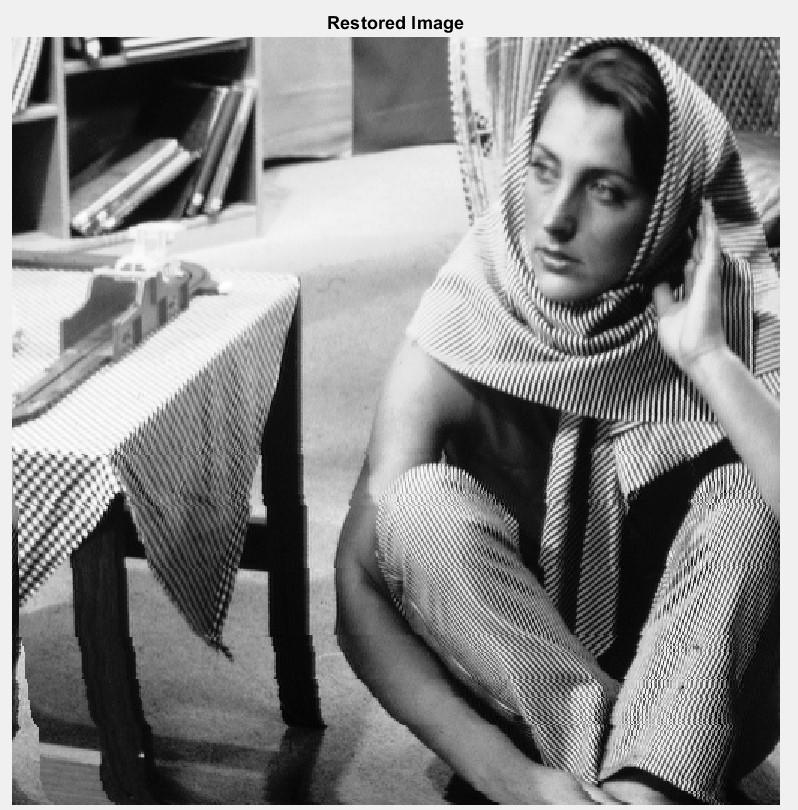

### PSNR

  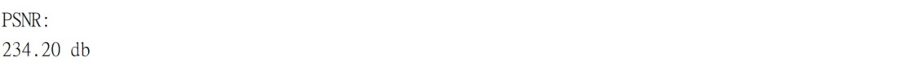

## b) Sets LH,HH,HL all to 0
### Restored image

  

### PSNR

  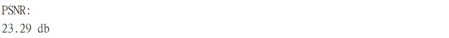

- Note the image after setting LL,LH,HL,HH to zero is as expected lower than using the high frequency data of the LL,LH,HL,HH subbands.

### Note
1. The DWT with the subbands attached can yields amazing restoration results.
2. High frequency components are important for image reconstruction.

# III. References

[1] [Advanced Digital Signal Processing, Adaptive Filters by Prof.Vaibhav Pandit](https://www.youtube.com/watch?v=088g4IB9blI)

[2] [Advanced Digital Signal Processing, LMS Algorithm by Prof.Vaibhav Pandit](https://www.youtube.com/watch?v=kXJ_WQlweiI&list=PLm_MSClsnwm8tzpHKvWlCdEeBba9yVsa_&index=139&t=369s)

[3] [MIT RES.6-008 Digital Signal Processing,Lec 17, 1975 by Alan Oppenheim](https://www.youtube.com/watch?v=oJv4dsUID0Q&t=841s)

[4] [EE123 Digital Signal Processing, SP'16 L12 - Discrete Wavelet Transform](https://www.youtube.com/watch?v=i0rPaAXjJoI&t=2730s)

[5] [Easy Introduction to Wavelets, by Simon Xu](https://www.youtube.com/watch?v=ZnmvUCtUAEE)

[6] [VLSI Digital Signal processing systems Design and Implementation, p25~28 by Parhi]()

[7] [Image Denoising Based on Improved Wavelet Threshold Function for Wireless Camera Networks and Transmissions,Sep 2015, Reserach Gate,Xiaoyu Wang Xiaoxu Ou Bo-Wei Chen Mucheol Kim](https://www.researchgate.net/figure/The-inverse-discrete-wavelet-transform-Here-h-i-i14-i-i-h-i-i14-i-i-h-i_fig7_283882847)

[8] [Image Compression and Wavelets,Steve Brunton,2021](https://www.youtube.com/watch?v=jclknhNJBrE)
