# <strong>
HW2 LMS Filter and DCT Filter design
</strong>
## 
VLSI DSP HW2

### 
Shun-Linag Yeh, NCHU Lab612

### 
3/18 2023

# INDEX
1. [Adaptive FIR Low pass filter](#adaptive-fir-low-pass-filter)
2. [Discrete Wavelet transform](#discrete-wavelet-transform)
3. [References](#references)

# Adaptive FIR Low pass filter
## Problem

  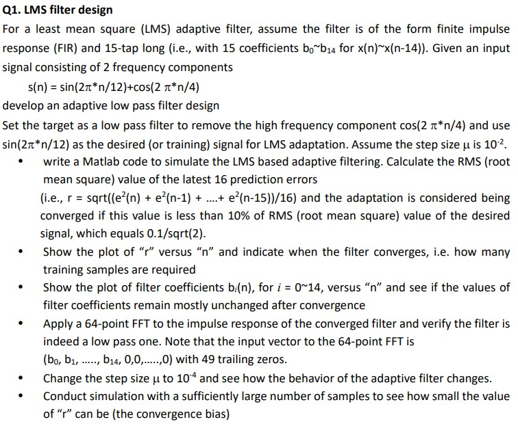

# Derivation steps
### Adaptive Filter specification

  

1. x(n) is the input signal, wn(z) is the adaptive filter block with coefficients of wn.
2. d_hat(n) is the generated system response and d(n) is the desired signal.
3. e(n) is the error between d_hat(n) and d(n)
4. The adaptive algorithm block determines which kind of policy we should use to find the suitable filter coefficients. In this HW, LMS algorithm is chosen.

### The adaptive FIR filter

  

  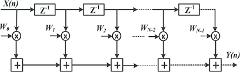

- The desired output is genereated through the p-tap FIR filter design, where wn is the coefficients that gets updated on the fly.

### Error function

  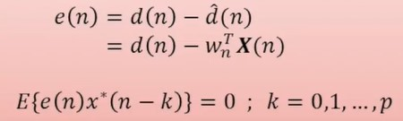

- Error function simply is the difference between the desired signal and the generated system response.

- Ultimate goal is to minimize the autocorrelation between error vector and input signal.

### LMS algorithm

  

- mu is the step sizes for the algorithm, which governs the variability of the coefficients in each iteration.
- e(n)X*(n) is the factor of auto-correlation between the input signal and the error function.

### RMS(Root mean square)

  

- Root mean square used to find the norm of the error vector, we hope that this value be as small as possible s.t. the system is converged.

# Code
### Adaptive Filters

  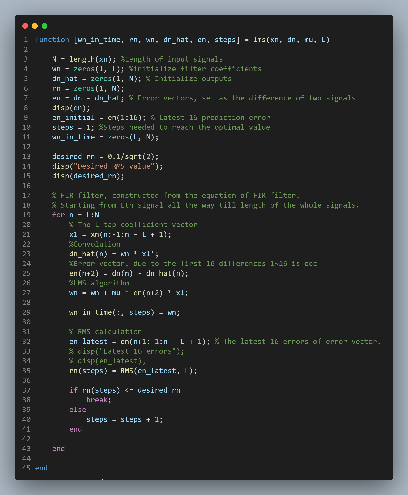

### RMS

  

### Main drivers

  

  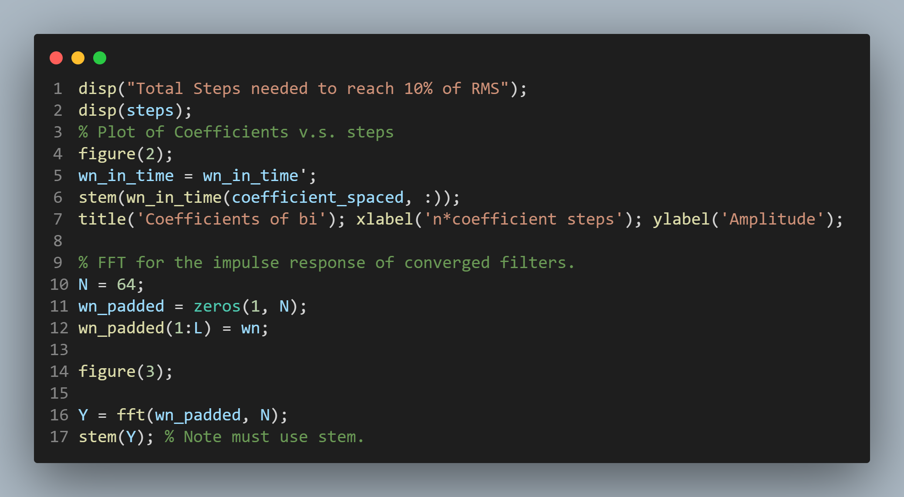

# Results
## Adaptive Filter Response n=100, mu = 0.01, sampleSteps = 1 and RMS over time

  

### Filter Coefficients over time

  

### Converged steps

  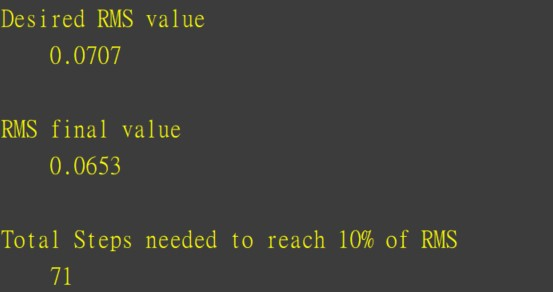

### 64-point FFT spectrum

  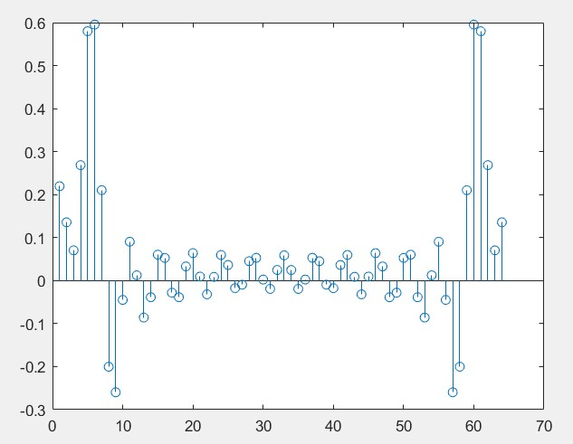

- The response is indeed a Low-Pass filter response.

## Adaptive Filter Response n=3000, mu = 0.0001, samepleSteps = 25 and RMS over time

  

### Filter Coefficients over time

  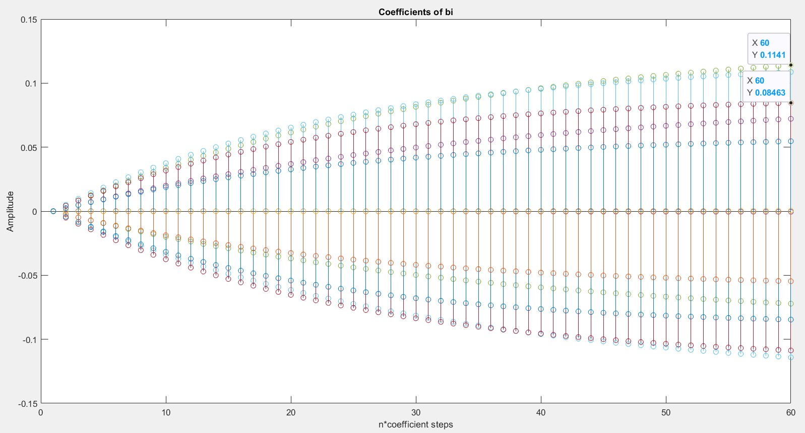

### Converged steps

  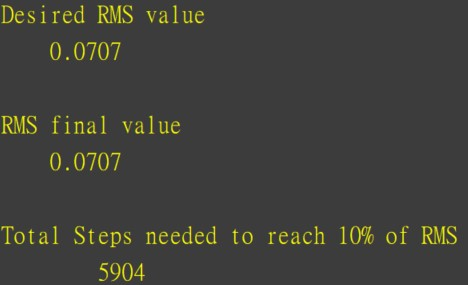

- Notice the changing of the RMS value responses more drmatically due to smaller step difference. Also it takes longer and more sample points for it to converge.

### RMS with large sample size n = 10000

  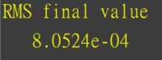

- The convergence bias is found, the filter cannot converge any further, it keeps on oscillating between within the convergence bias.

### Note
- Due to the fact that sample sizes are large for smaller mu, plotting all of the signals makes analysis hard, thus samples_steps is defined s.t. only a certain multiple of signal sample_steps are selected for plotting.

- The latest 16 prediction errors should be selected for caculation, selecting more than that might yield the wrong results, and the filter would never converge.

# Discrete Wavelet transform
## Problem

  

  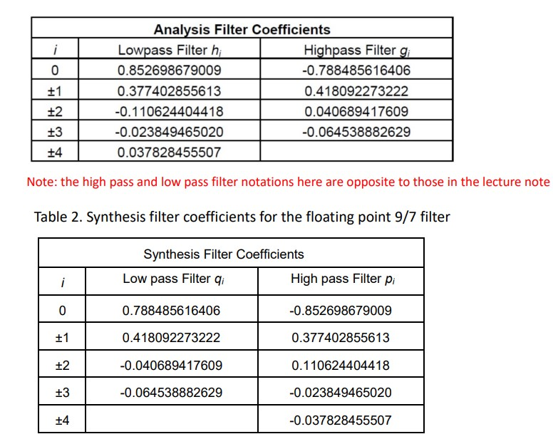

- Goal is to build a DWT filter by adopting the (9/7) filters composed of high pass and low pass components.

## Problem a

  

## Problem b

  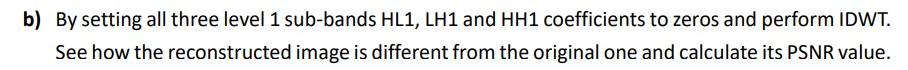

  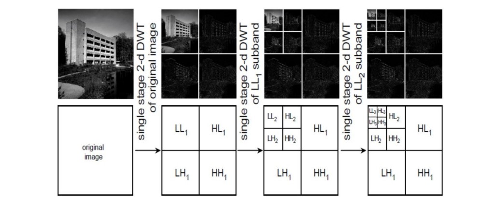

# Derivation steps
## Wavelet transform

  

- For a fourier transform, the orthnormal basis is selected as e^j2piFt as analyzing function, however for the wavelet has orthonormal basis of wavelet analyzing fuction phi(t).
- Fourier transform ouputs frequency, yet wavelet outputs a translation and scaled autocorrelation of the input.

  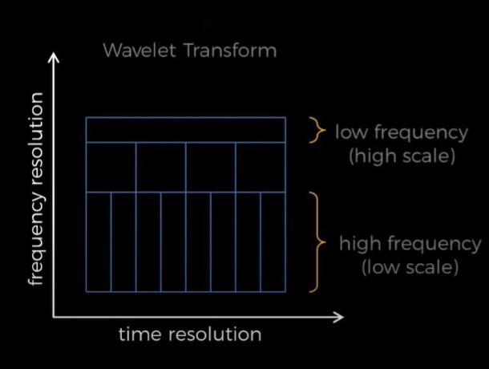

- Wavelet would has better time localization for high frequency yet worse time localization for low frequency.
- Wavelet is used to tackle with problem of time and frequency resolution since you cannot have both great time resolution and frequency resolution at the same time. Wavelet is the balance between time and frequency resolution.
- It is extensively used for compressing images.

## 3-level DWT transform

  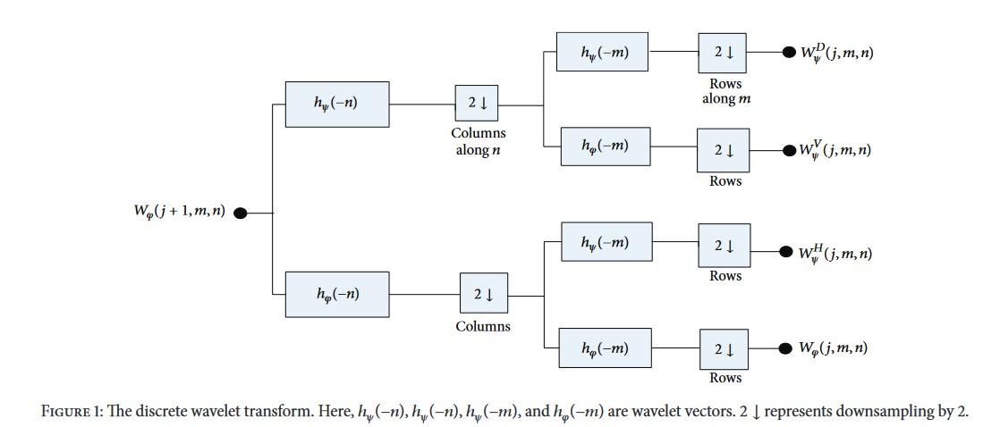

## 3-level IDWT transform

  

## Symmetric extension scheme

  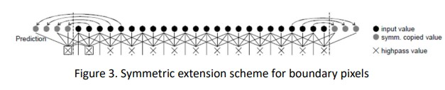

## PSNR(Peak signal to noise ratio) and MSE(Mean square error)

  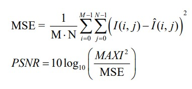

## QR Iterative Algorithm

## Code
### Main driver

  

### Tridiagonalization and QR iterative

  

### Givens Rotation

  

## Result
### Tridiagonalized matrix

### Eigenvalue matrix after eigen-decomposition

### Eigenvalue decompose using matlab

### Note
1. The result of the Eigen-decomposition differs due to the ordering of the orthnormal basis and the ordering of eigenvectors when calculating the QR matrcies.
2. The eigenvalues are all the same but in different orderings.

# Reference

[1] [University of South California, Section 4.2.1: Givens Rotations, Math610 Jim Lambers](https://www.math.usm.edu/lambers/mat610/class0208.pdf)
