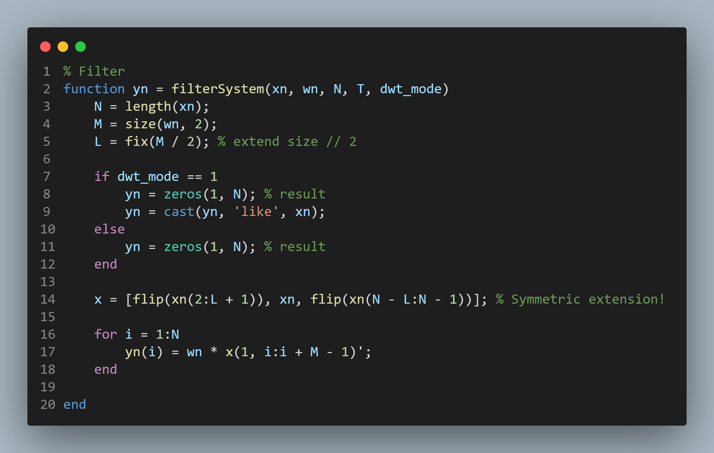
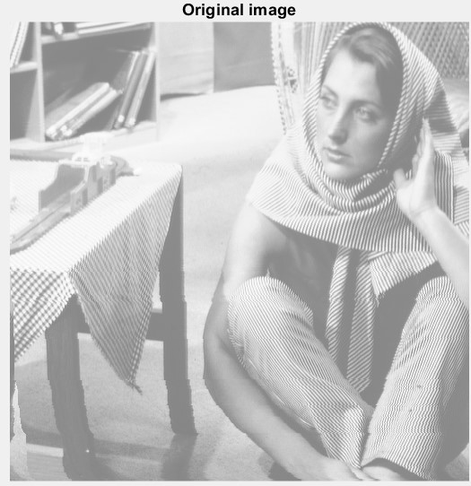
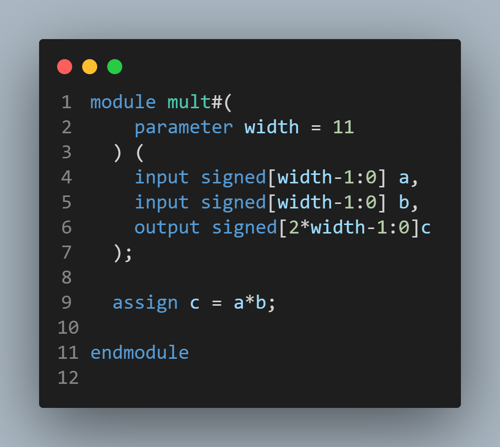

# <strong>
HW3 Fixed Point DWT Filter Design
</strong>
## 
VLSI DSP HW3

### 
Shun-Liang Yeh, NCHU Lab612

### 
4/07/2023

# INDEX
1. [Fixed-Point Discrete Wavelet Filter design](#i-fixed-point-discrete-wavelet-filter-design)
2. [Synthesis Result](#ii-synthesis-result)
3. [Ackowledgements](#iii-acknowledgement)
4. [References](#iv-references)

# I. Fixed Point Discrete Wavelet Filter Design
## Problem

  

- Goal is to change the original design of HW2 into a fix point design, searching for the best fix point and fraction length.

- Later find the area for the synthesized filter's multiplier,adder and registers for each DWT octave outputs.

# Derivation steps
## Discrete Wavelet transform Structure

  

- For the description of the DWT structure, look at VLSI DSP HW2

## Fixed Point Representation & Arithmetic

  

- Since floating point arithmetic units are expensive and difficult to generalised in HW design, fixed point representation for number is adopted.

- To make a fixed point number, all that we do is place this decimal somewhere in the middle. As an example, we’ll decide that the decimal point is between bits 14 and 15. Mostly, this is just the way that we now think about this number and the CPU doesn’t know the difference. However, there are a few special cases that we need to think about so that the CPU treats this number properly.

  

- Suppose that we multiply two 32-bit values. We will get an intermediate value that is 64-bits long. If each of these values were signed 16.15 fixed point (1 sign, 16 integer, 15 fraction), where is the decimal point in this intermediate variable? It’s right above bit 29. If you multiply two fixed point values, each of which with 17 bits above the decimal (16 integer and 1 sign) and 15 bits below the decimal, then we end up with an intermediate value that has 2x17 = 34 bits above the decimal, and 2x15 = 30 bits below the decimal, for a total length of 64 bits.

- Now, which of these do we actually care about? We want the output of this multiplication to also be a signed 16.15 fixed point, so we care about the bits that immediately surround the decimal point. Everything below that is underflow, which is ignored. And we better not have anything up here above the region of interest, because that means we’ve overflowed the representation. So, we care about these bits which hug the decimal. Multiply will not work if the number is too big. Thus we must check for the word length(WL) and Fraction Length(FL)
 if we want it to work.

## Matlab Fix-Point Designer

  

- Matlab fixed point designer offers great tools for tracing fix-point length, value and precision over the function you specified, it also generate graphs for easy analysis for your design. Enabling one to efficiently convert their algorithm into fixed point design.

# Code

### FIR Filter(Symmetric extended)

  

### g(n) High pass filter and h(n) low pass filter

  

  

### p(n) High pass filter and q(n) low pass filter

  

  

### Down Sampler

  

### UpSampler

  

### PSNR

  

### DWT octave

  

### IDWT octave

  

### Main driver

  

### Data Type

  

# Result
## Fixed Point statistical report
### Fixed Point Width length and fraction length

  

### Filter Coefficients

  

### Level 1 output

  

- In the fixed point designer, it tells you the range for your calculation also suggest you the length of the fix-point and fraction length.

### Level 2 output

  

### Level 3 output

  

## Original image

  

## DWT result

  

## Restored image

  

### PSNR

  

- The result is close to 50db, tuning any further result in a distortion or making the restoration lower than 50db.

### Note
1. Fix point designer is a powerful tool for analysis.
2. High frequency components are important for image reconstruction, thus the length for the filter coefficients are important for high-frequency restoration.
3. The low frequency components are the most important for main image reconstruction.

# II. Synthesis Result
- Synthesize the word length for adders and filter's registers results according to the matlab simulation into gate-level circuit.

# Multipler

  

  

# Adder

  

  

# Registers

  

## lv1

  

## lv2

  

## lv3

  

# III. Acknowledgement

- I would like to ackowledge EECS undergraduate Chun-Wei Su and EECS undergraduate Guan-Ting Du for their assistent throughout the research, design and implementation of this homework. Without them, this HW cannot become a reality.

# IV. References

[1] [ECE 4760, Adams/Land, Fixed Point arithmetic , Spring 2021](https://vanhunteradams.com/FixedPoint/FixedPoint.html)

[2] [Best Practices for Converting MATLAB Code to Fixed Point Using Fixed-Point Designer](https://www.youtube.com/watch?v=pXXNORqY1uU&t=1983s)

[3] [EE123 Digital Signal Processing, SP'16 L12 - Discrete Wavelet Transform](https://www.youtube.com/watch?v=i0rPaAXjJoI&t=2730s)

[4] [Easy Introduction to Wavelets, by Simon Xu](https://www.youtube.com/watch?v=ZnmvUCtUAEE)

[5] [Image Denoising Based on Improved Wavelet Threshold Function for Wireless Camera Networks and Transmissions,Sep 2015, Reserach Gate,Xiaoyu Wang Xiaoxu Ou Bo-Wei Chen Mucheol Kim](https://www.researchgate.net/figure/The-inverse-discrete-wavelet-transform-Here-h-i-i14-i-i-h-i-i14-i-i-h-i_fig7_283882847)
