# <strong>
HW4 Systolic Array Mapping & Mapping of Vector Quantization
</strong>
## 
VLSI DSP HW4

### 
Shun-Liang Yeh, NCHU Lab612

### 
4/29 2023

### 

# INDEX
1. [Dependence Graph Mapping](#dependence-graph-mapping)
2. [Problems & Solution](#problem--solution)
3. [References](#references)

# I. Dependence graph mapping
## Linear schedule Checking

  

- From the selected Scheduling Vector and Projection vector, check two conditions.
- Check whether the inner product of scheduling vector s and projection vector d is not equal to zero.
- Check whether the inner product of scheduling vector and every edges on DG is equal or greater then zero.

## Projection Procedure

  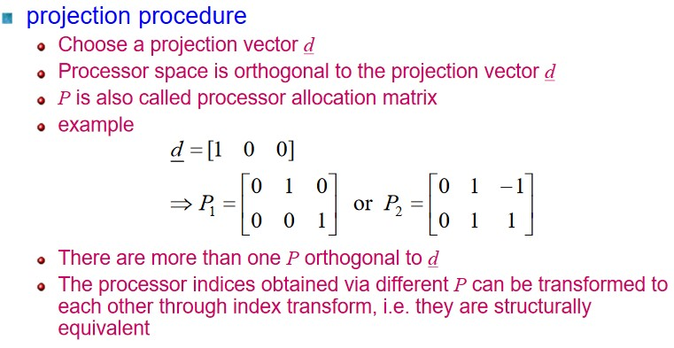

- Select a suitable processor vector P s.t. the inner product of processor vector P and projection vector d is 0.

## Space time transform

  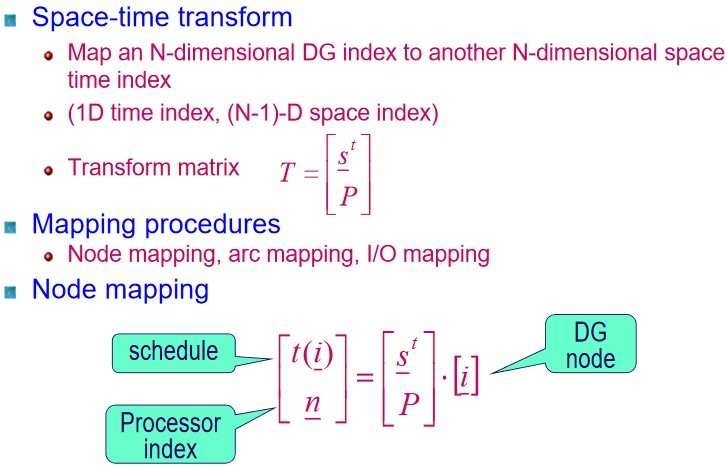

  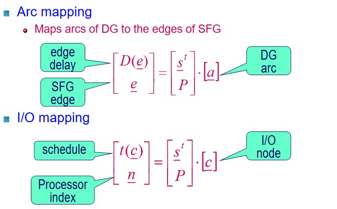

- From the derived s , d , P derive a transform matrix T for the N-th dimension DG graph.

- Start mapping every edges on the dependence graph according to the transform matrix T to get its space-time mapping results.

- From the mapping results of N-1 space-time dimension, sketch the edges on this new transformed space according to the mapping results.

- For more step by step algorithmic mapping examples, I suggest watching the lecture by Parhi, the video link is in the references.

# II. Problem & Solution
## Q1
### a)

  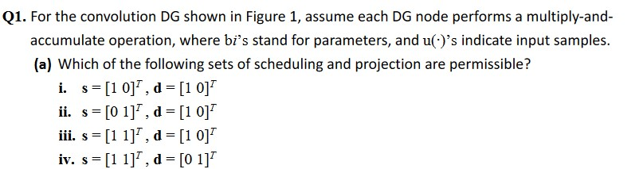

  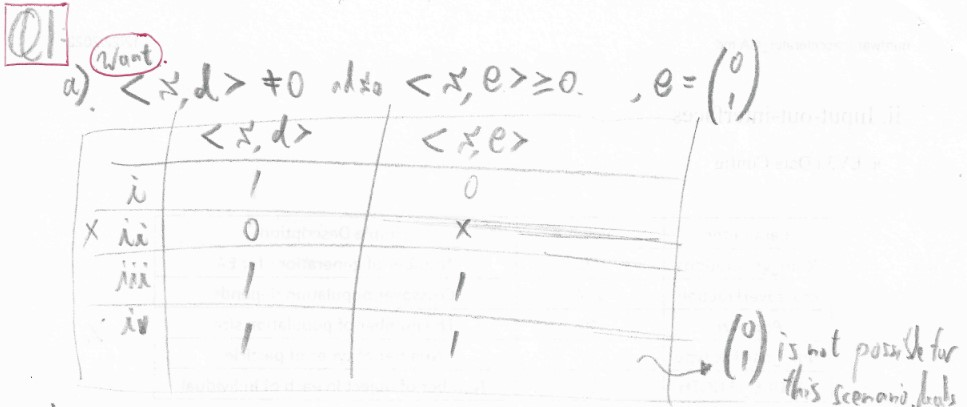

### b)

  

  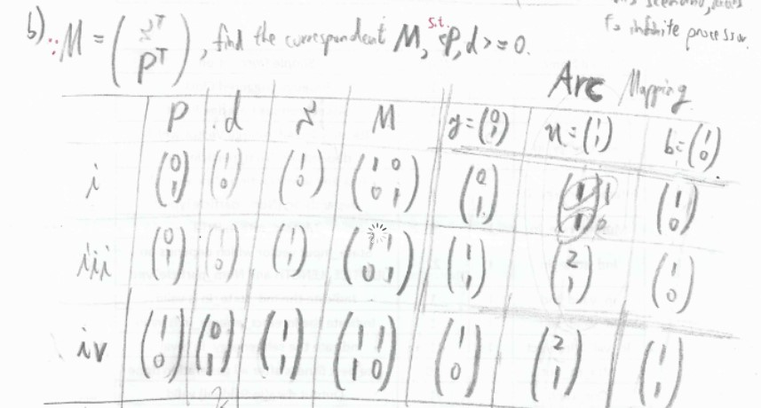

  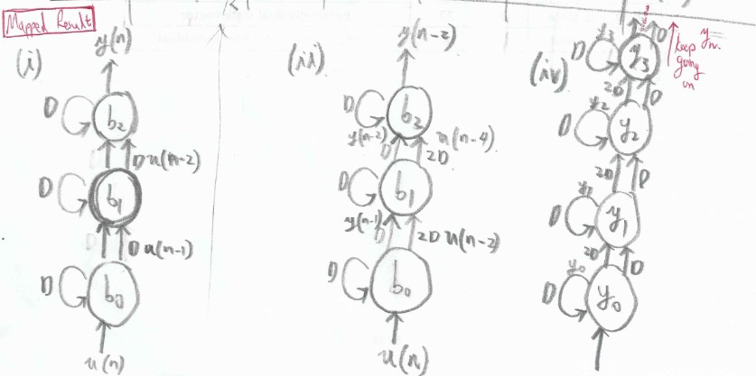

### c)

  

  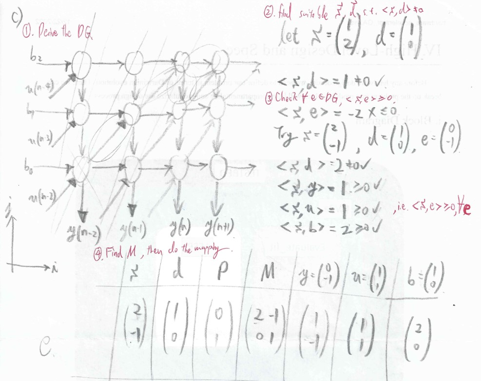

  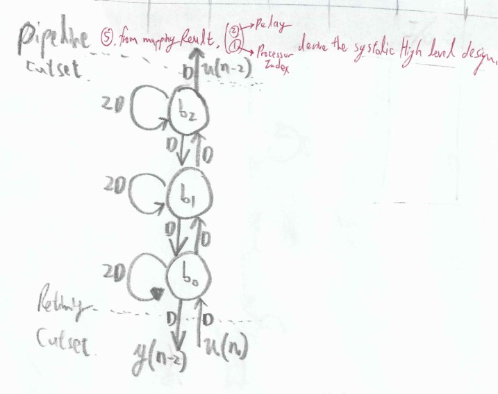

## Q2

  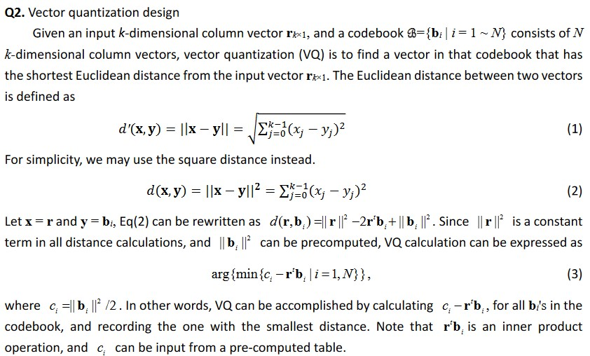

  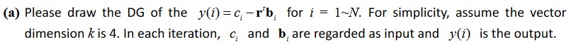

  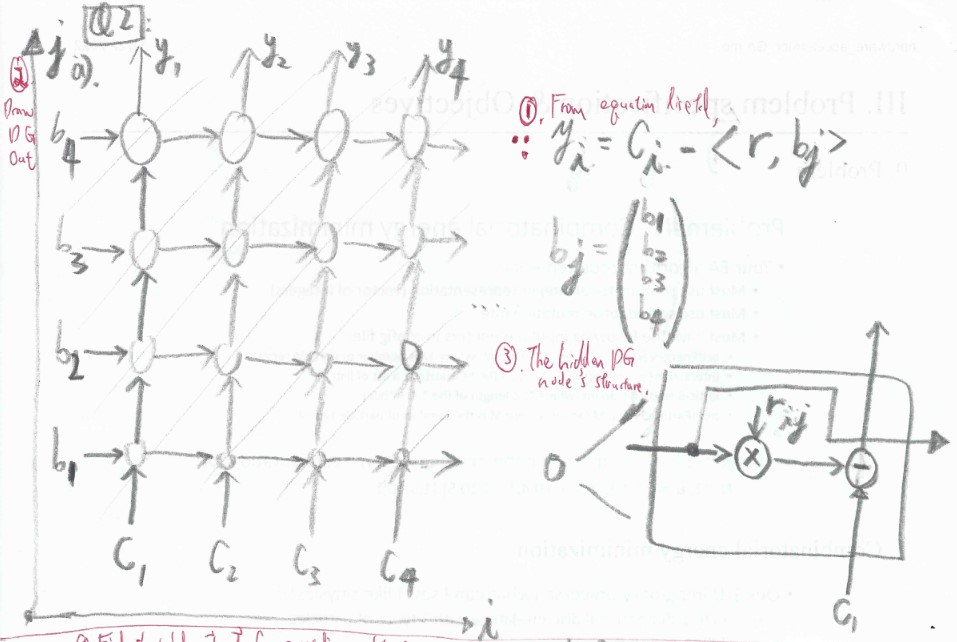

  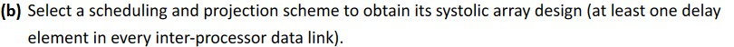

  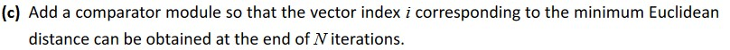

  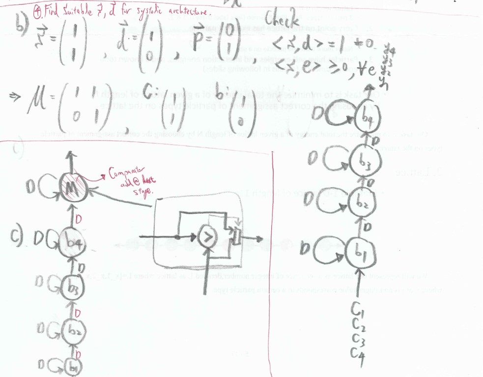

### Note
1. Though when deriving the high level architecture for systolic array, only the edges needed to be used, however; the schedule of inputs and outputs are also important during implementation.
2. While transforming from algorithm to DG, beware of the indices, also try to check whether the indices you assigned make sense by going through some examples.

# III. References

[1] [VLSI DIGITAL SIGNAL PROCESSING SYSTEMS DESIGN AND IMPLEMENTATION, CH7 Systolic Archtiecture design, Prof. Keshab Parhi, p189~p212](https://www.amazon.com/VLSI-Digital-Signal-Processing-Systems/dp/0471241865)

[2] [VLSI DIGITAL SIGNAL PROCESSING SYSTEMS DESIGN AND IMPLEMENTATION, CH7 Systolic Archtiecture design, exercises 11, Prof. Keshab Parhi, p215](https://www.amazon.com/VLSI-Digital-Signal-Processing-Systems/dp/0471241865)

[3] [UMN EE-5329 VLSI Signal Processing Lecture-15 (Spring 2019),Systolic Architecture Design , Prof. Keshab Parhi](https://www.youtube.com/watch?v=RBvmsQaP04s&list=PLT1QAv48lhQKpQnhLroOgr-uJUmZ4WvKq&index=15)

[4] [UMN EE-5329 VLSI Signal Processing Lecture-16 (Spring 2019),Systolic Architecture Design, Space-Time Mapping , Prof. Keshab Parhi](https://www.youtube.com/watch?v=dTynhUdydws&t=1622s)

[5] [Computer Architecture - Lecture 27: Systolic Arrays (ETH Zürich, Fall 2020), Prof. Onur Mutlu](https://www.youtube.com/watch?v=8zbh4gWGa7I&t=2161s)
