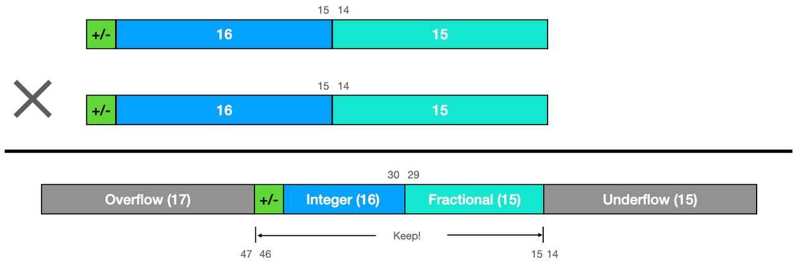
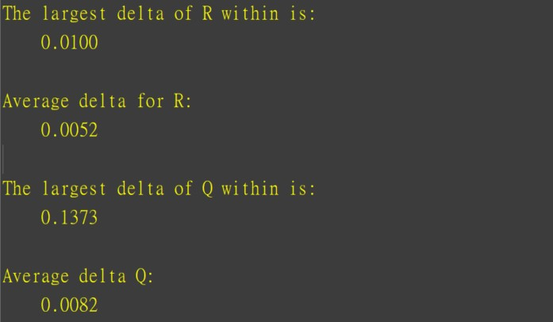
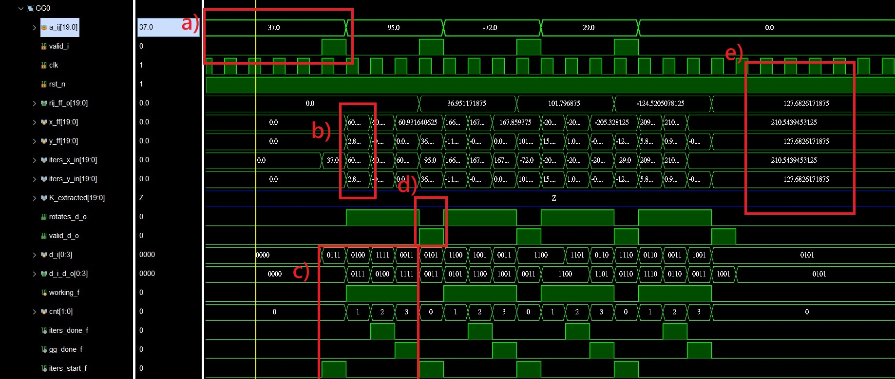

# <strong>
HW5 QR Cordic Systolic Array design
</strong>
## 
VLSI DSP HW5

### 
Shun-Liang Yeh, NCHU Lab612

### 
5/18/2023

### 
[Github Src Code](https://github.com/sicajc/VLSI_DSP_Notes_HW_Project/tree/main/hw5)

# INDEX
1. [Design Spec & Goal]()
2. [QR Decomposition & QR Cordic Algorithm](#i-fixed-point-discrete-wavelet-filter-design)
3. [Fixed-Point Analysis](#ii-synthesis-result)
4. [Testbench & Golden Model Generation](#iii-acknowledgement)
5. [QR Systolic Array Derivation](#iii-acknowledgement)
6. [Design of Cordic GG & GR](#iii-acknowledgement)
7. [System Architecture](#iii-acknowledgement)
8. [Results](#iii-acknowledgement)
9. [Acknowledgements](#iii-acknowledgement)
10. [References](#iv-references)

# I. Design Specification and Goal
## Problem

  

- Goal is to design a hardware QR factorization module, capable of generating the Q matrix and R matrix for a given NxN A matrix, i.e. A = QR

  

- Using the above QR factorization scheme we can get our Q & R matrix through a series of givens rotations, just like what we did in HW1

  

- The systolic array structure is listed above, left triangular PE arrays calculate the R matrix while right hand side calculate the Q matrix.

  

  

- As suggested, each PE should calculate their result using only 4 cycles, where 3 cycles are used for rotation and the last cycle used for the multiplication of K constants.

  

- Input is an 8-bit integer, value between 128~ -127, while we have to output the Q & R matrices in 12-bit outputs.

# II. QR Decomposition & QR Cordic Algorithm
## QR Decomposition

  

- According to the algorithm provided within the handout, we can generate the matlab QR algorithm model with slight modification.

  

- The algorithm is modified to allow it for computing the Q and R matrices.

## The Cordic Algorithm

  

  

- The basic idea is trying to rotates an (x,y) vector to (x',y') using the cosine and sine function, by approaching the desire angle iteratively. Approaching the desired angle in a number of iterations.

  

- After Understanding the Cordic Algorithm, one can try to code it out in matlab for verification.
## Rotation Mode

  

- The correct K must be found for the correct iteration numbers, for our case, we have to find K_12. Thus we have to first calculation what K_12 is.

  

- Above is the pseudoCode for cordic rotation mode, we can implement it in matlab code below.

  

- Rotation mode rotates the vector (x,y) by a certain angle to another new vector (x',y').

- The normal rotation mode uses a look up table to search for the angle needed for each iteration, above implements the cordic psuedoCode in matlab.

## Vector Mode

  

- The normal Vector mode also uses a look up table for approaching desired angle, however, the condition for rotation differs from the one presented in rotation mode. Simply changing the condition allows for conversion from rotation mode into vector mode.

- However, the above two implementation is not optimized for hardware design, since a huge LUT must be stored to provide the angle. Also, the rotation mode has to wait for the angle produced by vector mode which is a waste of time. Consequently, some optimization must be performed on the algorithm above.

# Optimizing Cordic Algorithm

  

- Due to the hardware structure provided above , we notice that the vector mode(gray node) in red box has to rotates the same amount of degree as other rotation mode(white node), thus we can further optimize by simply propogate the direction vector generated by Vector Mode to other Rotation Mode.

## Optimized Vector Mode

  

- Notice that now we does not need an LUT to store the angle alpha. However, we still need to send out the direction vector out such that the rotation mode rotates as vector mode did. Thus Vector Mode simply generates the direction of rotation. Since we do this in a Givens Rotation manner, we call this mode Givens Generation(GG).

## Optimized Rotation Mode

  

- Rotation mode receive the direction vector generated by vector mode to rotates the (x,y) vector to the desired (x',y'). Since we do this in a Givens rotation manner, we call this mode Givens Rotation(GR).

## Optimized QR Cordic Algorithm

  

- Thus we can change the original QR algorithm into the QR Cordic Algorithm by simply replace the location where angle must be generated and where coordinates (x,y) must be calculated.
- Calculate angle, uses vector mode. Calculate vector uses Rotation mode.
- After we obtained the Correct Cordic Algorithm, we have to convert it into fix-point design.

# III. Fixed-point QR Cordic Design
## Fixed point representation

  

  

- Fixed point representation is less expensive and easy to implement in hardware design. For more info please refer to HW3 DWT fixed point design.

## Matlab Fixed-Point Designer

  

- Using the matlab fixed-point designer I can convert the original QR cordice algorithm into a fixed point one, then find the best fixed point word length and fraction length for my design to meet the criterion.

## Criterion Delta

  

- The R matrix generated by fixed point algorithm must not be more than 1% error compared to the double precision R matrix. rij is the R matrix element calculated through double precision. rij_hat is the R matrix element calculate through fixed point algorithm.

- Since the input matrix is 8 bits integers, output matrices are 12 bits for both R & Q. We have 8 variables to search. The partial calculation word length and fraction length for both R & Q. Also the output fraction length for both R & Q. Also the word length and fraction length for K constant.

## Tester for fixed point algorithm

  

- This is the driver algorithm to test the average delta by running through a random number of matrices. To see if the proposed fixed point length meets the criteria or not.

## Result Fixed point Word Length and Fraction Length

  

  

- The optimal word length and fraction length is found using the fixed point designer, and being tested using the delta error calculation.The result was tested by running through 1000 test cases for verification, notice that on average the result delta is within 1 percent, so this proposed fixed-point word length and fraction length meets the criteria.

# IV. Testbench & Golden Model Generation
## Matlab testbench generation

  

- The following main loop generates A,Q,R patterns in matlab. Consist of qr_cordic_opt that is the fixed point algorithm we just derived. Send random matrix in to get the desired Q & R. Later write those result in binary format into the data.txt file. So that we can later read these data into the pseudoDRAM within the testbench.

## Generation of A

  

- The input matrix A is written out in an column-major reversed scanned order, such that the design can receive the data in a much more efficient manner.

## Generation of R, Q

  

- Both R matrix & Q matrix are written out to the dat file for comparision in testbench.

## Testbench

  

- The following is the testbench main loop for testing my circuit for a random number of test patterns. The reset_task resets the system, qr_feed_data_task feeds the value into circuit for consecutive 16 cycles. Later the testbench would wait for the out_valid signal to be raised. Checks the answer using the pseudoDRAM Q_GOLDEN & R_GOLDEN then delay in a random period of cycles, continue sending in new data into the circuits.

# V. QR Cordic Hardware Design
## Single Assignment Form

  

- We must first understand the Single Assignment form in the handout to understand how the suggested design is derived. We can notice that each nodes is a rotation of x,y. The result is then stored into nx,ny.

  

- Each of this nodes, represents a calculation nodes, which forms the fundamental calculation for our 3 dimensional DG construction.
- We can draw out the correspondent dependence graph using this SA form. Thus perform further derivation for our systolic array.

## QR Dependence graph

  

- The handout suggest a dependence graph which you can see is a pyramid like structure; however, this dependence graph is actually incorrect in a sense that the stacked k=2,3,4 should not be moving away from the i,j axes. The stacked k=2,3,4 should be move toward j axes. Otherwise, an incorrect DG might be created.

  

- a) is the Correct dependence graph, notice that the stacked k=2 is different than the stacked k=2 suggested in the handout, however, only by doing so we can created a reasonable DG.

- b) After performing the projection through d, we can get the triangular systolic array.

- c) Corresponent to k=1, which is the lowest part of our triangular systolic array DFG design.
- d) k=3 maps to the highest portion of the triangular systolic array DFG.
- e) Beware of the dg of k=4, since it is r44 in the R matrix, from the algorithm we know that, r44 is already created alongside with r34 in DG graph (1,4,3)=(i,j,k). Thus r44 would actually resides in the y value of DG node(1,4,3). As a result, k=4 is actually a redundant node thus can be removed.

- Note that Q matrices dependence graph can be derived in a similiar manner,thus trivial. Notice that k=4 is also redundent for Q because no rotation is needed to be performed for k=4 DG of Q. The derivation of dependence graph is left as an exercise for the reader.

## Scheduling & Correspondence of DG & DFG

  

- This is the DFG for our design. GG node is the Givens Generation nodes, generating the direction vector then the direction vector get propogated into the GR node which is the Givens Rotation noes.

  

  

- The red r11 means that the result r11 would get produced at (1,1,1) node in the cycle 17 since its computation time is 13~16 cycles.
- The yellow number marked within the DG node specified when this node get executed. And after projection you can know exactly when and where this particular computation would take place within your systolic array.
- To mark the scheduling onto the DG, one must first obtained a systolic array design using the scheduling vector s=(-1 1 1).
- Then perform folding to extends the execution cycles of every node. Also at the same time, beware of the dependency when you try to perform folding.
- Specially noted that, each GR would execute for 2 cycles for the first time before they send their first value to the next layer. After sending their first value, they send their value once every clock cycle. This can be spotted within the dependence graph. This is important for the later design of our PE units.

# Design of GG & GR
## GG

  

- This is the block diagram of Givens Generation Unit. valid_i signal is used to indicate when the GG starts its calculation. At the same time, one should send data through port aij. While calculating, GG generates the one cycle delayed rotation vector di alongside with the one cycle delayed rotates signal. Both of these signals get sent to GR units.

  

- Details of GG contains a sub-control counter indicating whether GG is rotating, working or multiplying K. When rotating, GG generates di from the cordic iters block. The final (r,0) value after rotation would replace the old (x,y), the result would be (0,r) = (x,y).

  

- Each of this sub-block represents an iteration in cordic. The boundary condition of determining whether the input value is 0 must be hanndled. Each iter sub-block generates a correspondent di signal during rotation. And the shift amount for both shifter is determined by the number of block also the value of counter.

  

### Down Sampler

  

### UpSampler

  

### PSNR

  

### DWT octave

  

### IDWT octave

  

### Main driver

  

### Data Type

  

# Result
## Fixed Point statistical report
### Fixed Point Width length and fraction length

  

### Filter Coefficients

  

### Level 1 output

  

- In the fixed point designer, it tells you the range for your calculation also suggest you the length of the fix-point and fraction length.

### Level 2 output

  

### Level 3 output

  

## Original image

  

## DWT result

  

## Restored image

  

### PSNR

  

- The result is close to 50db, tuning any further result in a distortion or making the restoration lower than 50db.

### Note
1. Fix point designer is a powerful tool for analysis.
2. High frequency components are important for image reconstruction, thus the length for the filter coefficients are important for high-frequency restoration.
3. The low frequency components are the most important for main image reconstruction.

# II. Synthesis Result
- Synthesize the word length for adders and filter's registers results according to the matlab simulation into gate-level circuit.

# Multipler

  

  

# Adder

  

  

# Registers

  

## lv1

  

## lv2

  

## lv3

  

# III. Acknowledgement

- I would like to ackowledge Prof. Huang for the design of the HW; also EECS undergraduate Chao Hsin-Tsai , EECS undergraduate Kuan-Ting Du, EECS graduate Shuan Yu Lin and my EECS graduate seniors Mo Shuan Kuma, Hun Rei Chang for their assistent throughout the research, design and implementation of this homework. Without them, this design cannot become a reality.

# IV. References

[1] [ECE 4760, Adams/Land, Fixed Point arithmetic , Spring 2021](https://vanhunteradams.com/FixedPoint/FixedPoint.html)

[2] [Best Practices for Converting MATLAB Code to Fixed Point Using Fixed-Point Designer](https://www.youtube.com/watch?v=pXXNORqY1uU&t=1983s)

[3] [VLSI DSP 2023, Lecture Handouts, Ch5 Mapping Algorithms Onto Array Structures 5-54~5-60, Y.T Hwang]()

[4] [EE 5324 – VLSI Design II , Kia Bazargan , University of Minnesota , Part IX: CORDIC Algorithms](http://socdsp.ee.nchu.edu.tw/class/download/vlsi_dsp_102/night/DSP/EE5324-CORDIC.pdf)

[5] [UMN EE-5329 VLSI Signal Processing Lecture-15 (Spring 2019),Systolic Architecture Design , Prof. Keshab Parhi](https://www.youtube.com/watch?v=RBvmsQaP04s&list=PLT1QAv48lhQKpQnhLroOgr-uJUmZ4WvKq&index=15)

[6] [2021_Spring_NCTU_ICLAB Lab03,Sudoku, Testbench and Pattern, mirkat1206](https://github.com/mirkat1206/2021_Spring_NCTU_ICLAB/tree/main/Lab03)

[7] [Rounding Numbers without Adding a Bias, Gisselquist Technology,LLC 2017](https://zipcpu.com/dsp/2017/07/22/rounding.html)
