# <strong>
HW6 Retiming, Unfolding and Folding
</strong>
## 
VLSI DSP HW6

### 
Shun-Liang Yeh, NCHU Lab612

### 
6/09/2023

# INDEX
1. [Problem & Solution](#i-problem--solutions)
2. [References](#iv-references)

# I. Problem & Solutions
## Q1

  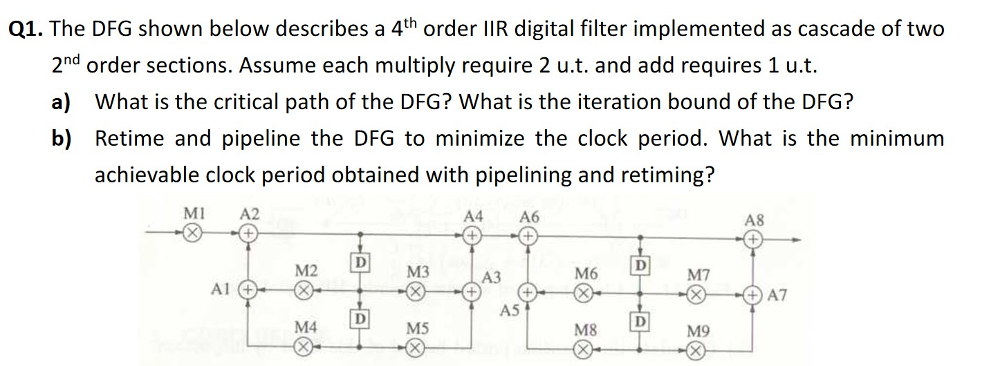

- Remember that you can do retiming and pipelining, not just simply perform piplining. The concept of pipelining feedforward cutsets and retiming feedback cutset is important.
- The art of retiming means moving the delays around the circuit, remember to draw out the retiming contour to ensure that you are doing the correct retiming.

  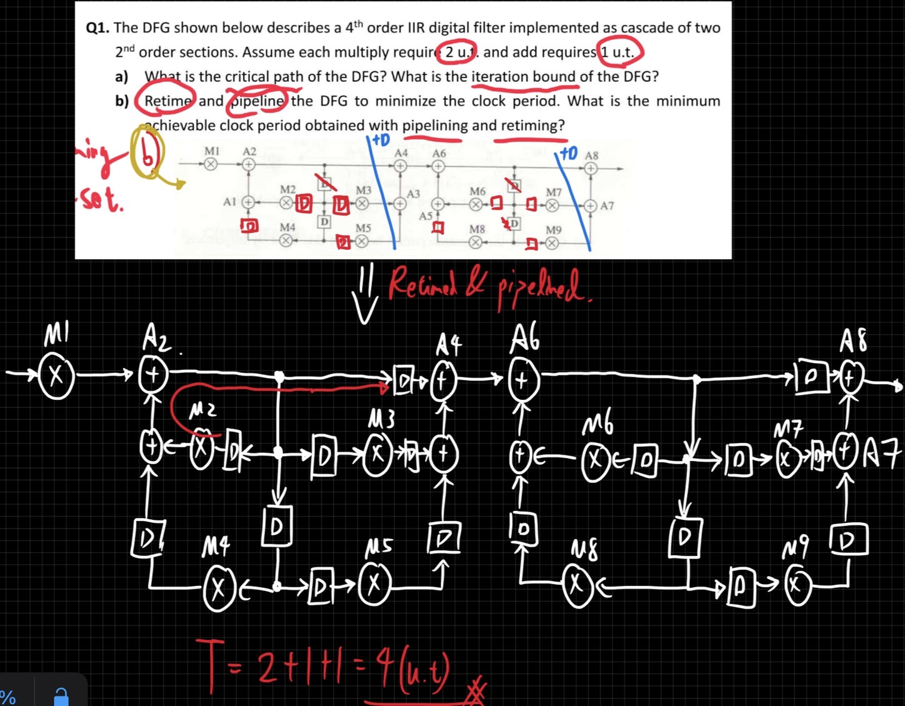

## Q2

  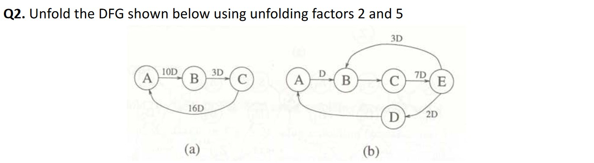

  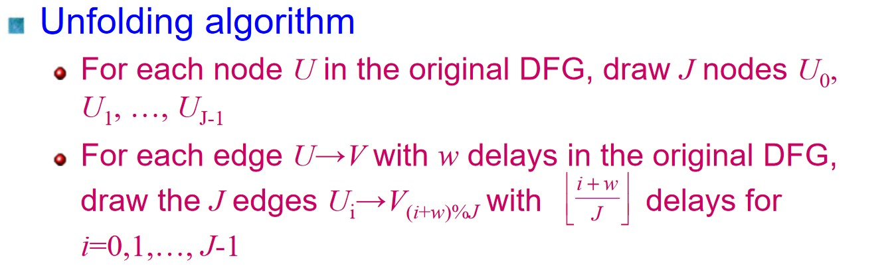

### a) J=2

  

### a) J=5

  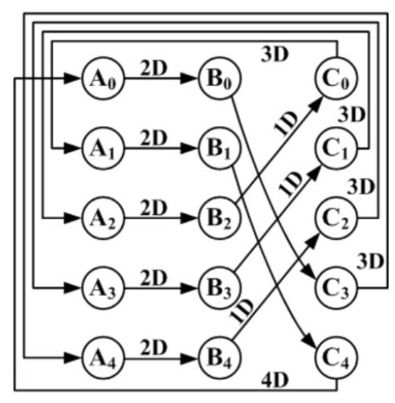

### b) J=2

  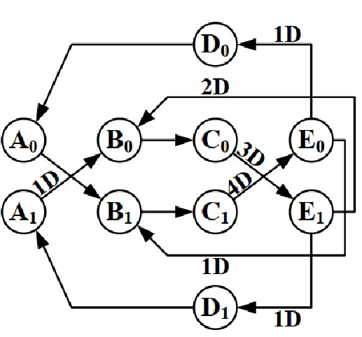

### b) J=5

  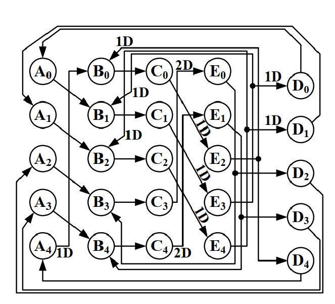

- Unfolding algorithm can be used to achieve the minimal Sampling period, the iteration bound however cannot be changed using unfolding.
- If the iteration bound of the circuit is not an integer, unfolding the circuit might help achieve the minimal sampling period at the cost of more HWs.
- Dummy nodes can be added to simplify the process of Unfolding a circuit.

## Q3

  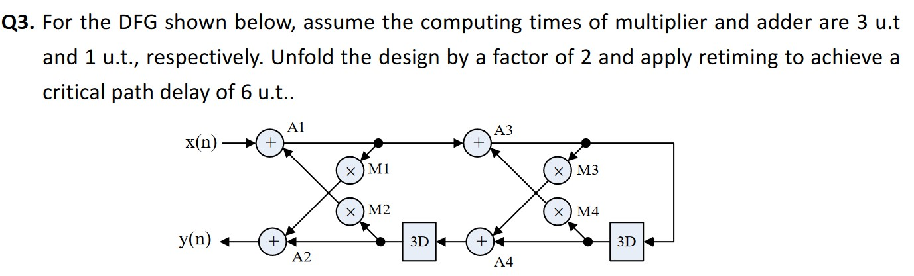

### First perform Unfolding with J = 2

  

### Perform the Retiming to achieve critical path of T = 6

  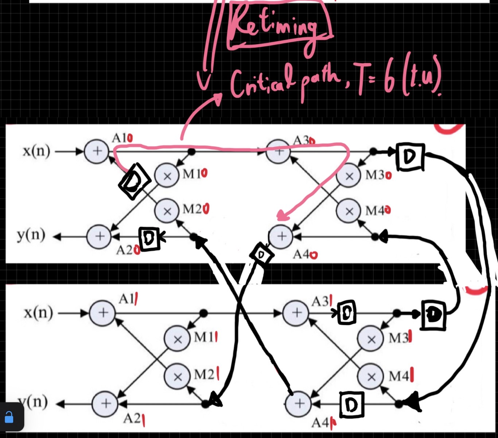

## Q4

  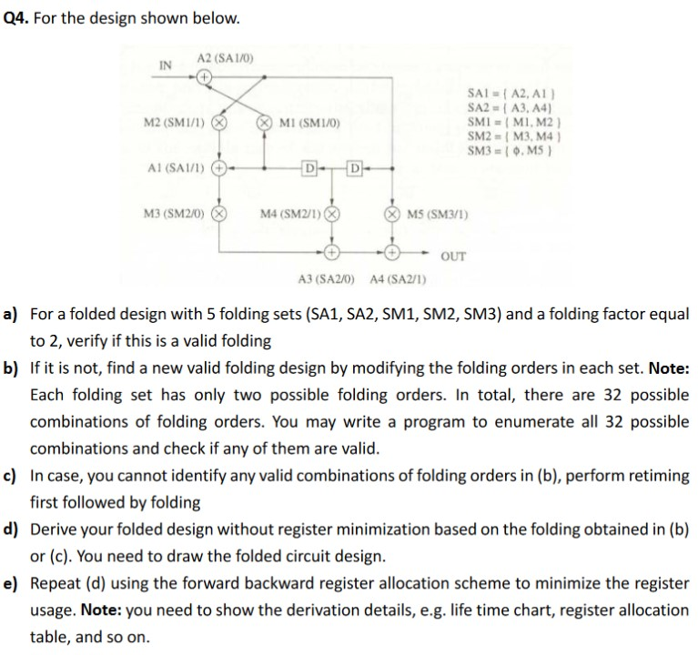

  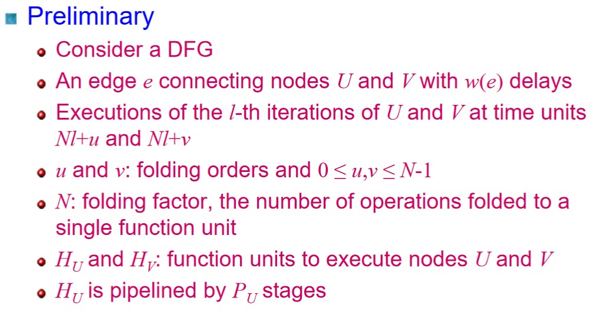

  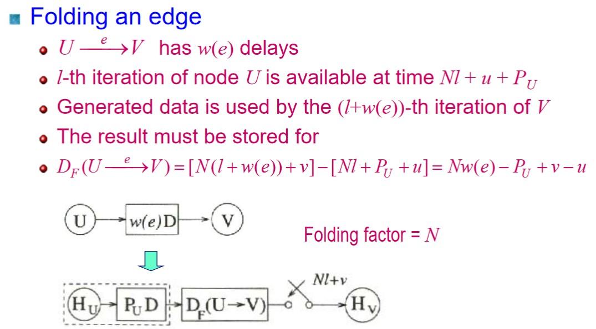

### a)

  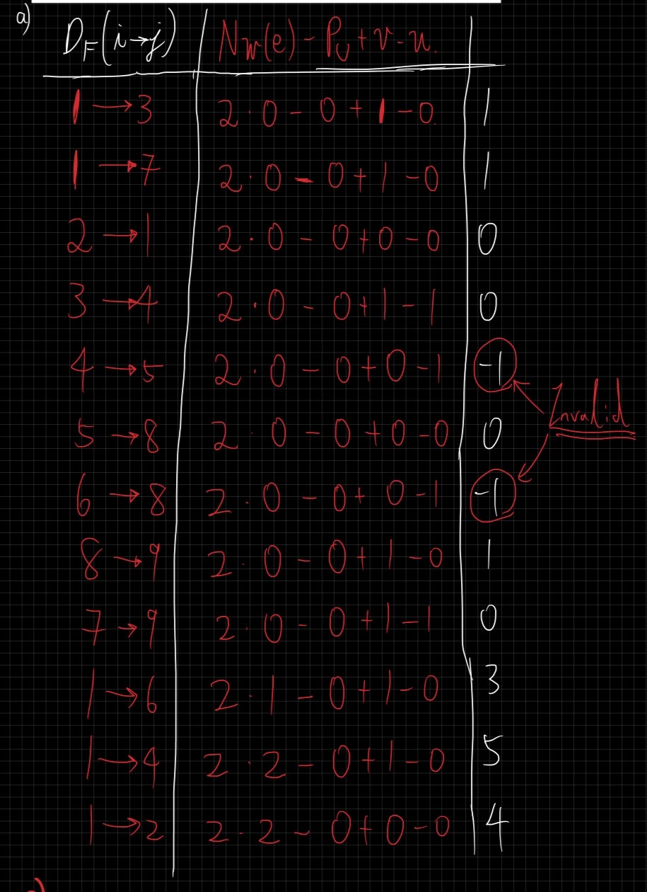

### b)
- By high level programming language, we can verify that all the permutations of the folding set is not valid.

### c) d)

  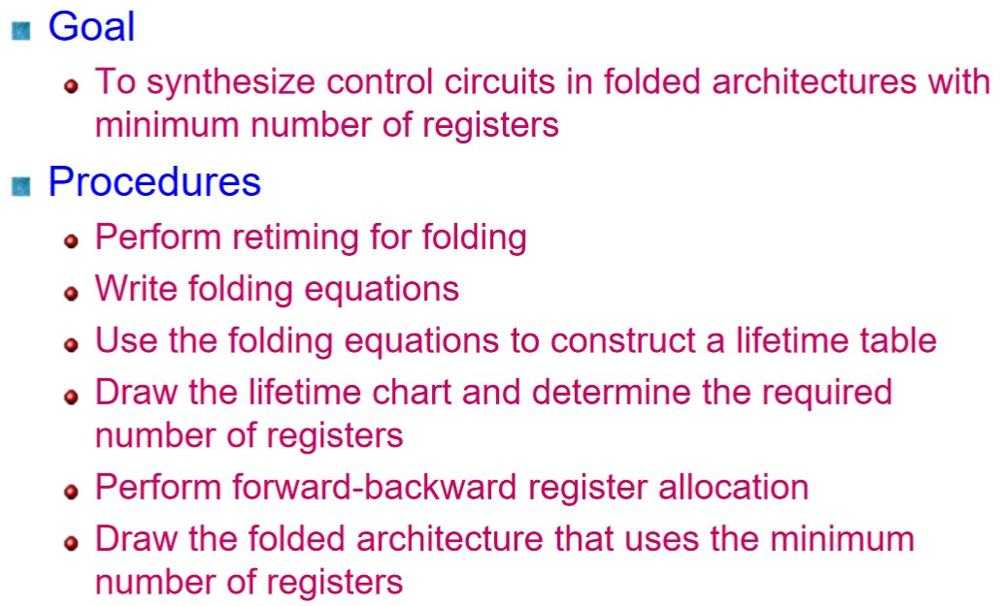

  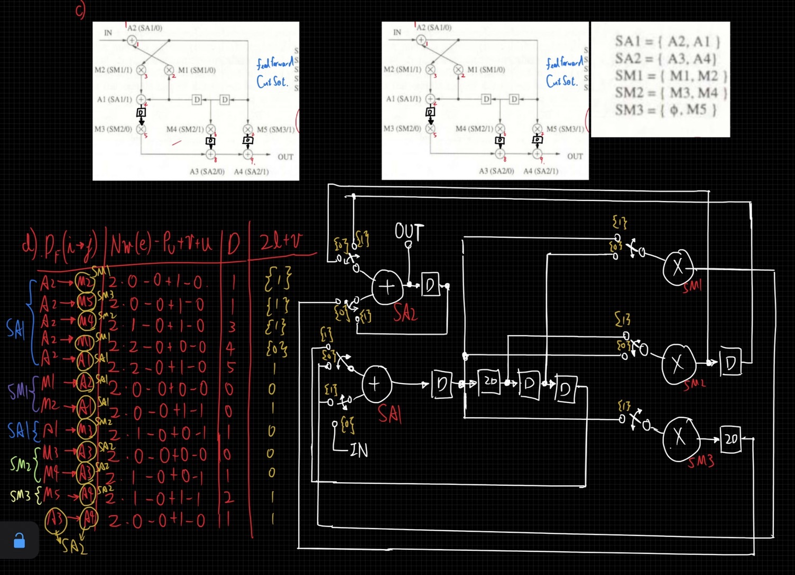

### e)

  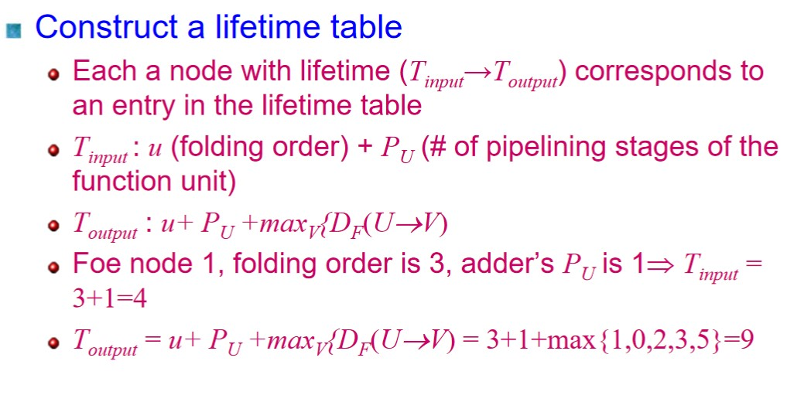

  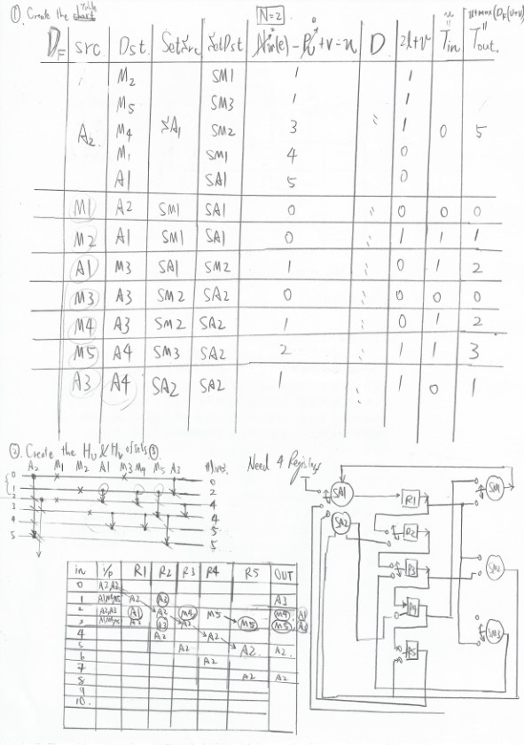

### Note
1. While doing register minimization, remember to mark the Src Node, Destination node and their correspondent sets to simplify the operations of mapping.
2. Remember where the input and output ports are.
3. Switches are switche in time instance Nl+v
4. Tin and Tout might varies in different architecture.
5. When drawing the linear lifetime table, remember to draw until the next iteration starts to overlap with the past data.

# II. References

[1] [UMN EE-5329 VLSI Signal Processing Lecture-11 (Spring 2019),Folding Transformation of Data flow Graph , Prof. Keshab Parhi](https://www.youtube.com/watch?v=_XMtfQkcbtM&list=PLT1QAv48lhQKpQnhLroOgr-uJUmZ4WvKq&index=11)

[2] [UMN EE-5329 VLSI Signal Processing Lecture-10 (Spring 2019), , Unfolding of Data-Flow Graphs with Switches and Digit-Serial Design , Prof. Keshab Parhi](https://www.youtube.com/watch?v=nbxykpXfnps&list=PLT1QAv48lhQKpQnhLroOgr-uJUmZ4WvKq&index=10)

[3] [VLSI DSP 2023, Lecture Handouts, Ch8 Folding 8-5 ~ 8-38, Y.T Hwang](http://socdsp.ee.nchu.edu.tw/class/download/vlsi_dsp_101/night/DSP/Ch8_folding.pdf)

[4] [VLSI DSP 2023, Lecture Handouts, Ch6 Unfolding 7-4, Y.T Hwang](http://socdsp.ee.nchu.edu.tw/class/download/vlsi_dsp_102/night/DSP/Ch6_unfolding.pdf)
